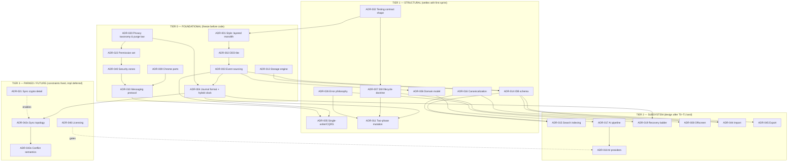

# LEDGE — ARCHITECTURE DECISION RECORD (ADR-000 → ADR-046)
**Status:** Phase 3 output · Permanent project record · Append-only
**Authority:** Product Vision & Product Specification are LOCKED. This record binds implementation. Decisions here may be superseded only by a *new* ADR that links back — never edited in place.
**Reading time budget:** This document contains 46 decisions. Decisions are deliberately uneven in depth — founder-level rigor is spent on decisions that are irreversible or trust-bearing; cosmetic decisions get one paragraph.

## How confidence works here
- **High** — decided; change requires a new ADR and evidence.
- **Medium** — decided, but we hold a named doubt; review at the stated trigger.
- **Parked** — intentionally undecided; the decision window is named, and the constraints its future decision must honor are fixed *now*.

---

# SECTION A — META-ARCHITECTURE (style, process, structure)

---

### ADR-001 — Overall architectural style
**Deciding / why.** The top-level shape of the codebase. This choice silently determines testability, MV3-survivability, and whether a solo maintainer can still reason about the system in year three.
**Options.**
1. *Layered monolith (single bundle, strict module boundaries, ports & adapters / hexagonal)* — boring, debuggable, maps perfectly onto an extension (background, pages, offscreen are natural adapters). Disadvantage: discipline is cultural, not enforced by tooling.
2. *Microkernel + plugins* — attractive for "extensibility," but we have banned third-party plugins (charter) and internal plugins buy nothing over ports. Rejected as ceremony without payoff.
3. *Distributed/event-microservices* — category error inside one extension; rejected.

| Factor | Assessment |
|---|---|
| Scalability | Scales to ~100k LOC by module, not by service |
| Performance | No IPC beyond what extension contexts already force |
| Complexity | Lowest of the three |
| Maintenance | Lowest; one artifact, one test suite |
| Security | Fewer trust boundaries to audit |
| Privacy | No data flow surprises; boundaries explicit |
| Migration | N/A (first decision) |
| Flexibility | Ports keep every vendor-swappable seam open |
| MV3 | Native fit (contexts as adapters) |
| Cross-browser | One manifest-family; adapters absorb differences |

**Decision:** Layered monolith, hexagonal inside (option 1). Extension *contexts* (service worker, offscreen document, extension pages) are infrastructure adapters around one shared application core. **Confidence: High.** **Reconsider:** only if a second product surface (e.g., a true desktop companion) is green-lit.

---

### ADR-002 — Domain-Driven Design vs. traditional layered
**Deciding / why.** How much DDD ceremony the core carries. The spec's language (Mission lifecycle, snapshot-before-close invariant, deletion laws, Trash policy) is genuinely a domain — but full DDD (factories, repositories-as-collections, specification objects) is overweight for this team size.
**Options.** (1) *Full DDD* — strongest invariants, heavy boilerplate. (2) *DDD-lite: rich domain model + application services + ports, no tactical-pattern maximalism* — invariants live in domain entities/domain services that are pure and framework-free; everything else is plain. (3) *Anemic model + procedural services* — cheapest now, guarantor of invariant leaks later (the snapshot-before-close rule *will* end up half-enforced in three places).

| Factor | Assessment |
|---|---|
| Scalability | Bounded contexts (Core, Memory/AI, Knowledge-IO) prevent big-ball-of-mud |
| Performance | Neutral (pure functions, no framework tax) |
| Complexity | Medium-low |
| Maintenance | Invariant tests are cheap and pinpoint |
| Security | Pure domain layer = tiny audit surface for trust rules |
| Privacy | Deletion laws encoded once, in domain services — good |
| Migration | Domain classes versioned alongside events |
| Flexibility | New use cases add services, not refactors |
| MV3 | Domain runs anywhere (SW, offscreen, tests — no DOM) |
| Cross-browser | Domain is platform-free by rule |

**Decision:** DDD-lite (option 2). Three bounded contexts: **Lifecycle** (tabs, missions, parking, restore), **Memory** (AI-derived artifacts), **Portability** (import/export/share). **Confidence: High.** **Reconsider:** if contributors >3, revisit whether module enforcement (lint rules/dependency-cruiser) must replace culture.

---

### ADR-003 — Event sourcing vs. CRUD
**Deciding / why.** The spec states "the Journal is canonical; state is derived; nothing is ever lost." One can honor that with a CRUD model plus a bolt-on audit log — or make the journal *literally* the source of truth (event sourcing) and derive state from it. This is the most consequential technical decision in the project.
**Options.**
1. *CRUD + audit log* — familiar; but audit logs drift from truth exactly on the days that matter (crashes); "current state" and "history" can disagree; crash recovery becomes forensic.
2. *Full event sourcing (journal is the only truth; all state is projections)* — crash recovery = replay (W7 becomes trivial and *provable*); undo/trash/Recently Closed/Sessions all fall out as projections; import/export become event batch ops; sync v2 becomes event replication (ADR-014). Costs: schema discipline forever, replay engineering, projections to maintain, a learning curve.
3. *Hybrid: ES for lifecycle events, CRUD for the rest* — the "rest" is settings and caches, which are trivial anyway. So option 2 with pragmatic scope.

| Factor | Assessment |
|---|---|
| Scalability | Event counts: heavy user ~1–3k events/day → ~1M/yr; fine within IDB (compaction ADR-004) |
| Performance | Append = O(1) writes; reads served by projections, not replay |
| Complexity | High upfront; bounded to ~25 event types by spec discipline |
| Maintenance | Requires event-schema governance (ADR-033); pays back in debug-ability |
| Security | Truth is one append-only stream → tamper-evident design is natural |
| Privacy | "Derived data dies with source" = stop projecting + purge: *cleaner* than CRUD tombstones |
| Migration | New event types are additive; hardest part is old-event fidelity (ADR-034) |
| Flexibility | Sync, undo, share links all reuse the stream — maximal future leverage |
| MV3 | Journal in IndexedDB survives SW death: the fit is *why* ES wins here |
| Cross-browser | IndexedDB-everywhere; no exotic APIs |

**Decision:** Event sourcing (option 2). Journal = truth; every read model is disposable and rebuildable. **Confidence: High (but acknowledged as the project's biggest bet).** **Reconsider:** if, after the first chaos-test cycle (ADR-032), replay/durability engineering exceeds the maintenance budget of a solo maintainer — fallback ADR would degrade to CRUD+journal, touching only the projection layer's authority, not the spec.

---

### ADR-004 — Journal implementation
**Deciding / why.** *How* the journal is stored decides whether W7 (crash recovery) is a promise or a hope — including the spec's demand to "recover to last consistent point and disclose precisely."
**Options.**
1. *Single append store in IndexedDB, segmented with sequence numbers + per-segment CRC32, sealed segments* — truncation on corruption is detectable; partial tail discardable precisely; cheap.
2. *One record per event, no segmentation* — simplest, but corruption boundaries blur; per-record CRC costs little — viable degenerate case of (1).
3. *WAL-style dual-region write (storage.local head marker + IDB segments)* — detects torn writes more rigorously; extra complexity, marginal gain over (1).

**Clock & identity (decided together — this is the sync-shaping moment):** every event carries `{ seq (per-device monotonic), lamport, deviceId, wallClock }` — a hybrid logical clock. Device IDs are random, user-invisible, created on first run. *We adopt this format on day one even though sync ships in v2* — retrofitting clocks later would be a data migration of the truth itself.

| Factor | Assessment |
|---|---|
| Scalability | Segment compaction (snapshot events + truncate) caps growth; ~1M events/yr/user worst case → acceptable with yearly compaction |
| Performance | CRC32 cheap; batch append in one transaction |
| Complexity | Medium; the hardest code in v1 — invest here |
| Maintenance | Event-schema registry owned by Lifecycle context |
| Security | Checksums detect corruption (not adversarial tamper — threat model is accidents, not APT; note in ADR-020) |
| Privacy | Journal *contains* the sensitive data → included in all delete/purge paths; compaction must physically purge as well (see ADR-020's purge law) |
| Migration | Journal format versioned; importers for v(n-1) segments mandatory |
| Flexibility | Relay-sync, replay tooling, rescue console all reuse this |
| MV3 | IDB transactions are atomic per commit — aligns with snapshot-before-close invariant |
| Cross-browser | No exotic APIs; CRC in pure JS/WASM-optional |

**Decision:** Option 1 (segmented, checksummed, hybrid-clock, per-device namespaces). Compaction: snapshot event every N events or 30 days, then physical segment collapse honoring purge law. **Confidence: High.** **Reconsider:** segment format only if chaos tests reveal torn-write modes IDB can't surface.

---

### ADR-005 — State management (CQRS-lite / single-writer)
**Deciding / why.** Extensions have 3+ live contexts (SW, quiet page, overlay). If any context can write, invariants die. Choose where writes live.
**Options.** (1) *Single-writer in the SW:* all mutations are commands sent to the service worker; contexts subscribe to read-model updates (pub/sub). Matches MV3 (SW already owns Chrome APIs), kills race classes by construction. (2) *Shared-IDB free-for-all:* option rejected — IDB is multi-context-safe transactionally, but domain invariants aren't enforceable cross-context. (3) *Single-writer in an offscreen doc:* viable, but the SW is the only context the platform guarantees can be woken by browser events; keep authorization there.

| Factor | Assessment |
|---|---|
| Scalability | Commands ~ dozens/sec peak: trivial |
| Performance | One message hop per mutation; reads are local (projections mirrored to contexts) |
| Complexity | Medium — messaging protocol must be rigorous (ADR-012) |
| Maintenance | One writer = one place to test invariants |
| Security | Only SW context holds high-trust ports; content contexts stay dumb |
| Privacy | No cross-context data scatter; Memory processing confined (ADR-041) |
| Migration | Protocol versioned |
| Flexibility | New surfaces subscribe; never write |
| MV3 | SW-restart-safe: commands are durable (queued in IDB before dispatch — see ADR-011) |
| Cross-browser | Same wake semantics on Chromium family; Firefox event-page equivalent exists |

**Decision:** Single-writer SW; CQRS-lite; contexts get streaming read-model deltas, never authority. **Confidence: High.** **Reconsider:** if Firefox's non-persistent background becomes mainline again, this still holds (writer location unchanged).

---

### ADR-006 — Domain model (aggregates & invariants)
**Deciding / why.** Where the spec's laws physically live so they can't be bypassed by a careless PR.
**Model (decided):** Aggregates = **Mission** (root; holds tab membership, lifecycle state, conclude flag) and **TabRecord** (entity reachable only via Mission application services). **MissionSession** snapshots are immutable value objects produced by domain services. Domain **policies** (deletion law, retention law, purge law, confidence-presentation law) are pure functions. **Invariants enforced at the aggregate/service boundary:** (a) *snapshot-before-close* — Park use case must receive durable ack of the park-intent event before issuing browser mutation (two-phase, ADR-011 durability); (b) *nothing parked is ever system-deleted*; (c) *derived Memory cannot outlive source*; (d) *AI never emits irreversible commands* (technical mirror of spec §6.12: AI pipeline output type literally cannot construct mutation commands — see ADR-041).

| Factor | Assessment |
|---|---|
| Scalability | Tiny model (5 core types) — reviewable in one sitting |
| Performance | Pure functions; zero platform deps |
| Complexity | Low by design (ADR-002) |
| Maintenance | Invariants have direct unit tests |
| Security | Trust rules centralized → auditable |
| Privacy | Purge laws as policies = compliance by construction |
| Migration | Entities version; events carry the truth |
| Flexibility | New spec features = new services/policies |
| MV3 | Runs in any context (tests: node) |
| Cross-browser | Platform-free |

**Decision:** As above; anemic-model temptation explicitly rejected for the four invariants. **Confidence: High.** **Reconsider:** if a fifth invariant emerges, it joins the boundary — never a UI check.

---

# SECTION B — PLATFORM REALITIES (MV3, messaging, contexts)

---

### ADR-007 — Background service worker lifecycle
**Deciding / why.** MV3 kills the SW aggressively (~30s idle). Every durability promise passes through this constraint. Choose the survival doctrine.
**Doctrine (decided):**
1. **Statelessness:** the SW wakes, rehydrates *disposable* in-memory maps from IDB, serves, dies. Nothing authoritative lives in memory.
2. **All listeners registered synchronously at top level** (hard MV3 requirement).
3. **Durable command queue:** incoming mutation commands are persisted (enqueue event) *within the message handler's first transaction* before side effects; SW death mid-operation ⇒ resume on next wake (idempotent re-entry). This is the mechanical heart of snapshot-before-close; the two-phase park is: `commit park-intent → verify ack → mutate browser`. If SW dies between phases, boot reconciliation: intent committed but tabs still open per `tabs.query` → re-issue close (or leave open and mark intent stale — spec failure rule favors *leaving open*; user never loses tabs to an over-eager cleanup).
4. **Crash detection without a shutdown hook:** `chrome.storage.session` set on SW start; it survives SW recycling but not browser restart. Absent-after-relaunch ⇒ browser-level termination ⇒ run W7 recovery reconciliation (cross-check `chrome.sessions` recentlyClosed as belt-and-suspenders source).
5. **Long work lives offscreen** (ADR-008); SW only orchestrates.
6. **`runtime.onStartup`/`onInstalled` handled distinctly** (first-run vs boot vs update paths per spec W1/W7).

| Factor | Assessment |
|---|---|
| Scalability | Wake cost amortized; heavy user wake ~ tens/day idle |
| Performance | Cold wake target <200ms to ready (ADR-029 budget) |
| Complexity | Highest-risk area; mitigated by chaos harness |
| Maintenance | Chrome behavior drift = standing watch item |
| Security | Less surface than persistent page |
| Privacy | No keep-alive hacks that extend data exposure windows |
| Migration | N/A |
| Flexibility | Doctrine survives foreseeable MV3.x |
| MV3 | **This ADR *is* the MV3 plan** |
| Cross-browser | Firefox event pages broadly compatible; Safari: parked (ADR-043) |

**Decision:** As doctrine above. **Confidence: Medium-High** (behaviorally verified by chaos tests, not faith). **Reconsider:** on any announced SW-lifetime changes in Chrome release channels; revisit each stable/beta diff.

---

### ADR-008 — Offscreen document strategy
**Deciding / why.** AI inference, import/export streaming, and index building need DOM/WASM and minutes-scale lifetimes the SW can't have.
**Decision.** One shared offscreen document ("workroom"), spawned by SW with declared reasons, explicitly closed after an idle window. Capability-reason enums have shifted across Chrome releases ⇒ reasons resolved via capability detection at runtime, never hard-coded single-path. WASM requires CSP `wasm-unsafe-eval` on extension pages (documented in ADR-040 with its security note). WebGPU used opportunistically for embeddings later; WASM SIMD is the baseline.

| Factor | Assessment |
|---|---|
| Scalability | One doc multiplexes all heavy jobs |
| Performance | Spin-up ~100–300ms; amortize by batching |
| Complexity | Medium; lifecycle ownership must be single (SW) |
| Maintenance | Reason-enum drift — capability detection absorbs it |
| Security | No remote content ever loads in it (local pages only) |
| Privacy | Content indexing occurs here, device-only |
| Migration | N/A |
| Flexibility | Can host future SQLite-WASM worker |
| MV3 | First-class citizen; the sanctioned escape hatch |
| Cross-browser | Chromium-only API ⇒ hidden behind port; Firefox adapter degrades AI throughput |

**Confidence: Medium.** **Reconsider:** if Chrome signals first-class worker support for extensions (long-running workers proposal), migrate heavy jobs off offscreen.

---

### ADR-009 — Chrome API abstraction (ports)
**Deciding / why.** Direct `chrome.*` calls sprinkled through code = untestable, unportable, unmockable.
**Decision.** Every platform capability sits behind a named port in `application/ports`: `TabsPort, WindowsPort, TabGroupsPort, NativeSessionsPort, EventsPort, AlarmsPort, OffscreenPort, PermissionsPort, StorageAreaPort(local/session), FaviconPort, CommandsPort, ContextMenusPort, DownloadsPort(later), IdlePort`. Adapters per browser family; **contract tests** (ADR-032) run the same suite against every adapter. Promise-based internally (wrap callback APIs at the boundary). TypeScript `never`-exhaustive error mapping to typed errors (ADR-026).

| Factor | Assessment |
|---|---|
| Scalability | Ports multiply cheaply |
| Performance | One indirection; negligible |
| Complexity | Low-medium, pays immediately in tests |
| Maintenance | Chrome API diffs land in one file per port |
| Security | Capability inventory *is* the port list — auditable |
| Privacy | Permissions map 1:1 to ports (ADR-022) |
| Migration | Adapter versions coexist during big API shifts |
| Flexibility | Firefox = new adapters, not new core |
| MV3 | Promise normalization handled once |
| Cross-browser | This *is* the cross-browser strategy |

**Confidence: High.** **Reconsider:** never structurally; adapters individually as browsers move.

---

### ADR-010 — Extension messaging architecture
**Deciding / why.** Commands, queries, and event streams cross contexts constantly; an untyped postMessage soup is where extension projects go to die.
**Decision.**
- **Protocol:** discriminated-union envelopes `{ v, kind: command|query|event, name, payload, cid }`, versioned (`v`), handshake-checked.
- **Commands/Queries:** request/response with correlation id; timeout + typed error return (never throw across contexts).
- **Events (read-model deltas):** long-lived `Port` streams; replay-from-seq supported so a reopened quiet page can catch up.
- **Validation:** runtime payload validation at every context boundary (hand-rolled assertion functions generated/derived from TS types; zero-dependency policy — see ADR-037 note). Content-script-originated messages (future indexing) go through a *separate, narrower* schema — high-trust commands are never accepted from content contexts.
- **Honest async:** responses may be `accepted` (queued) vs `applied`; UI distinguishes (ties to durability queue, ADR-011).

| Factor | Assessment |
|---|---|
| Scalability | ~dozens of message types at v2; union scales fine |
| Performance | Structured clone; batch deltas on 60fps surfaces |
| Complexity | Medium |
| Maintenance | Schema registry + golden fixtures in tests |
| Security | Boundary validation is the injection firewall |
| Privacy | Deltas carry references, not content, unless subscribed surface needs it |
| Migration | `v` bump + dual-read window |
| Flexibility | New surfaces = new subscriptions |
| MV3 | Ports die with sender; replay-from-seq covers SW recycling |
| Cross-browser | `runtime.Port` universal |

**Confidence: High.** **Reconsider:** adoption of a schema codec lib if type count >100.

---

### ADR-011 — Command durability & two-phase browser mutation
**Deciding / why.** The riskiest integrity question in the product: mutating the user's browser from a context Chrome can kill mid-execution.
**Decision.** As fixed in ADR-007.3, elevated to its own ADR for visibility: **every browser-affecting operation is (1) intent-event committed durably, (2) acked, (3) executed, (4) completion event committed. Boot-time reconciler walks incomplete intents and resolves conservatively** (never completes a close that can't be re-proven; spec failure law: leave open + disclose). All executors idempotent (same intent-id re-run = same end state).

| Factor | Assessment |
|---|---|
| Scalability | Queue depth normally <5 |
| Performance | Adds one IDB txn per mutation (~ms) — accepted, it's the price of the promise |
| Complexity | Medium-high; concentrated in one reconciler module |
| Maintenance | Chaos tests guard it permanently |
| Security | No privilege escalation paths (intents are internal-only) |
| Privacy | Intents contain URLs — lifecycle follows journal purge law |
| Migration | Intent schema versioned like events |
| Flexibility | New browser ops inherit the pattern |
| MV3 | Explicitly designed *for* SW mortality |
| Cross-browser | Identical semantics on Chromium; Firefox adapter implements same store |

**Confidence: High (design), Medium (until chaos-validated).** **Reconsider:** never weakened; only strengthened if new intent classes appear.

---

### ADR-005b/12 — Reserved (numbering slot kept for Stability) — see ADR-005.

---

# SECTION C — STORAGE & RETRIEVAL

---

### ADR-013 — Storage engine
**Deciding / why.** Journal, projections, sessions, memory, indexes — where do bytes live?
**Options.** (1) *Raw IndexedDB* — zero deps, maximal ceremony; schema/migration code becomes a second product. (2) *Dexie.js (IDB wrapper)* — ~90KB, a decade mature, transaction/migration ergonomics that materially reduce defect risk. (3) *SQLite-WASM on OPFS* — tempting: real SQL, FTS5 full-text built in, single-file exportability; but larger binary, younger ecosystem in extensions, OPFS-in-SW constraints (sync handles unavailable in service workers → worker-in-offscreen needed), and dual-source-of-truth hazard (journal in IDB always; SQLite as projection is viable later).

| Factor | Assessment |
|---|---|
| Scalability | IDB handles GBs; journal compaction caps growth |
| Performance | Indexed gets p95 budget (ADR-029); FTS5 later if free-text pressure |
| Complexity | Dexie lowest; SQLite highest |
| Maintenance | Dexie: upgrade cadence low; SQLite: toolchain churn higher |
| Security | One dep (Dexie) — vendored & pinned; SQLite adds binary surface |
| Privacy | Both local-only |
| Migration | Dexie migrations proven path |
| Flexibility | Storage behind `StorageEnginePort` → SQLite can attach later as search projection |
| MV3 | Both fine; OPFS caveats noted |
| Cross-browser | IDB universal; OPFS still uneven → another reason to defer (3) |

**Decision:** IndexedDB via Dexie, wrapped by `StorageEnginePort`; no data path may touch Dexie except the storage adapter (keeps the SQLite door genuinely open). **Confidence: Medium-High.** **Reconsider:** if corpus >50k tabs with full-text demand outgrows the JS index (ADR-014), or OPFS+sync-handle story matures uniformly.

---

### ADR-014 — IndexedDB schema strategy
**Deciding / why.** Store shapes and index choices are hard to change later with data in place.
**Schema (v1 canon):**
- `events` — journal segments + index entries: `[segmentId, seqRange]` records `{ seq, lamport, deviceId, type, payload, crc }`; index on `(deviceId, seq)`.
- `missions` — projection; by `id`; indexes: `state`, `lastActiveAt`, `state+lastActiveAt` (compound for archive sorts).
- `tabs` — projection; by `id`; indexes: `missionId`, `state`, `urlCanonHash`, `domain`, `lastActiveAt`, `missionId+state`.
- `sessions` — snapshots by `id`; indexes: `missionId+takenAt` (compound).
- `memory` — derived artifacts by `id`; indexes: `kind`, `subjectId` (mission/tab), `kind+subjectId`; **tagged `derivedFrom` event ranges** to enforce die-with-source.
- `trashMeta` — purge scheduling (or fold into entity `deletedAt`; decision: fold in; sweeper queries index `deletedAt`).
- `meta` — `[key]` schema version, device id, migration state, checkpoint pointers.
- **Golden rules:** (a) projections never back-write into events; (b) readers preserve unknown fields on round-trip (forward tolerance — an old build must not destroy new-schema data it didn't understand; hard requirement for rollback and future multi-device version skew); (c) every store has a documented rebuild-from-journal path except `events` (truth) and `meta`.

| Factor | Assessment |
|---|---|
| Scalability | Indexed lookups O(log n); no scan-path queries allowed (lint-checked in adapter tests) |
| Performance | Compound indexes sized to top-5 query patterns only — index bloat is a write tax |
| Complexity | Low-medium |
| Maintenance | Migration per version (ADR-034) |
| Security | No plaintext content store by default (content index opt-in & segregated store) |
| Privacy | `memory.derivedFrom` makes die-with-source mechanical |
| Migration | Versioned; unknown-field preservation tested (golden fixtures) |
| Flexibility | New projections add stores without touching old ones |
| MV3 | Standard IDB |
| Cross-browser | No fancy features (no IDB 3.0 novelties in v1) |

**Confidence: High.** **Reconsider:** query-pattern audit at v1.2; add indexes only behind measured need.

---

### ADR-015 — Search indexing
**Deciding / why.** Reflex Search is the "sense organ." Choose v1 mechanics while keeping the semantic door open.
**Decision.**
- **v1:** local inverted index (title tokens, domain, URL tokens, topics) built as a projection from journal events; BM25-ish scoring + recency/open-state boosts; index records in IDB (rebuildable). Tokenizer handles CJK/latin decently at MVP (unicode-aware segmentation; full CJK bigram fallback).
- **Dupes:** canonical URL hash index (ADR-016) powers W11 markers; near-dupe similarity rides title-token Jaccard (cheap) — flagged medium-confidence per spec.
- **Later (Ledge+):** embedding index (on-device model in offscreen doc; optional encrypted cloud assist, spec §6.8) — implemented as an *additional rank source* behind the same `SearchRankPort`; never a replacement that breaks if the model's missing (Principle 29).
- **Content full-text:** opt-in per-site indexing; segregated object store; denylisted categories default-off (finance/health domains); dies with source tab.

| Factor | Assessment |
|---|---|
| Scalability | 50k records → index ~ tens of MB; acceptable |
| Performance | p95 <100ms @ MVP 10k corpus budget (ADR-029) |
| Complexity | Medium (tokenizer edge cases are the swamp) |
| Maintenance | Ranking constants tunable without schema change |
| Security | No queries leave device |
| Privacy | Full-text path is the sensitive one → strict opt-in, segregated, purge-chained |
| Migration | Index = rebuildable projection; zero migration risk |
| Flexibility | Rank sources compose (keyword ∪ semantic later) |
| MV3 | Index build in offscreen, throttled (ADR-029) |
| Cross-browser | Same everywhere |

**Confidence: Medium-High.** **Reconsider:** tokenizer/CJK quality at first multilingual user cohort; FTS5 via SQLite projection if ranking needs maturity jump.

---

### ADR-016 — URL canonicalization policy
**Deciding / why.** Duplication detection, import dedupe, and "already kept" whispers all depend on a *stable* canonical form. Wrong canonicalization silently splits or merges user content — a trust bug, not a cosmetic one.
**Decision.** Conservative canonicalization v1: lowercase scheme/host, strip default ports, strip a maintained denylist of tracking params (`utm_*`, `fbclid`, `gclid`, `igshid`, `mc_cid`, `_hsenc`, …), keep all other params verbatim, keep fragments (some apps route by fragment; dropping them merges distinct content), normalize trailing slash on bare path only. Canonical form is used for *matching*, never for display or restore (we always restore the original URL). Rule list ships data-driven (updates don't require schema migration).

| Factor | Assessment |
|---|---|
| Scalability | O(1) per URL |
| Performance | Hash once at event time |
| Complexity | Low; risk is semantic, not technical |
| Maintenance | Param denylist is living data |
| Security | Blocks a JS:-URL smuggling path (allowlist http/https only) |
| Privacy | Matching material is hashed only; originals untouched |
| Migration | Re-canonicalization sweep is a projection rebuild, safe |
| Flexibility | Rules versioned per-user (corrections whitelist pairs — spec W11) |
| MV3 | N/A |
| Cross-browser | Same |

**Confidence: Medium** (semantic risk acknowledged). **Reconsider:** false-merge reports from the field → tighten toward params-keep default.

---

# SECTION D — AI SUBSYSTEM

---

### ADR-017 — AI pipeline architecture
**Deciding / why.** Twelve invisible AI responsibilities (spec §6) need one pipeline that survives SW death, respects the confidence constitution, and can't ever mutate the browser.
**Decision.** A **durable job pipeline**: jobs are IDB-persisted `{id, capability, subjectRefs, priority, state, attempts, confidenceFloor}`, enqueued by projections (event-driven), executed by workers in the offscreen doc (ADR-008), results written as Memory artifacts carrying `{confidence, provider, modelClass}` per spec. Pipeline laws:
1. **Output typing:** AI jobs physically cannot construct mutation commands (types don't exist in that package) — the spec's action bar enforced by module isolation (ADR-041).
2. **Idempotent & coalescing:** same subject+state hash ⇒ skip; debounce storms (tab-open bursts).
3. **Priority lanes:** interactive (rename on user gesture) > maintenance (summaries) > background (topics).
4. **Cost/heat governance:** batching; pause when hidden/battery-saver; per-day budget caps for cloud class (Ledge+ control).
5. **Degradation ladder per capability** (ADR-018): heuristic always available first — AI *enriches*, never gates.

| Factor | Assessment |
|---|---|
| Scalability | ~1M jobs/yr heavy user; pipeline drains continuously |
| Performance | Off critical path entirely; interactive lane budgeted |
| Complexity | Medium-high, but isolated in Memory context |
| Maintenance | Model churn isolated behind providers |
| Security | No DOM access to live pages here (indexing path separate + consented) |
| Privacy | Inputs minimized per capability (titles-only default); content-class inputs only with indexing consent |
| Migration | Artifacts version-stamped; rebuildable from journal (Memory is derived) |
| Flexibility | New capability = new job type + provider binding |
| MV3 | Offscreen execution; SW orchestration only |
| Cross-browser | Degrades to heuristics where compute paths absent |

**Confidence: Medium-High.** **Reconsider:** if interactive-lane latency demands on-SW inference (small models directly in SW — watch WASM-in-SW ergonomics).

---

### ADR-018 — AI abstraction layer & provider strategy
**Deciding / why.** Model landscape shifts monthly; commitment to any one engine is unwise.
**Decision.** Capability-typed provider port: `NamerProvider, ClusterProvider, SummarizerProvider, EmbedderProvider, IntentProvider…`, each with an **ordered fallback chain** assembled by capability detection:
`Heuristic (always, offline) → OnDeviceML (WASM/WASM-SIMD/WebGPU in offscreen) → BuiltInBrowserAI (Chrome Prompt/Language APIs where present — detected, never assumed) → CloudDepth (Ledge+, per-category opt-in, redaction layer at boundary)`.
Provider responses must return `{value, confidence, modelClass}`; low confidence → presentation fallback per spec §6.11 constant. Cloud path passes through a **redaction gateway** (strips URL params per policy, titles where user flags mission private).

| Factor | Assessment |
|---|---|
| Scalability | On-device scales with fleet; cloud scale is a COGS knob (budgets) |
| Performance | Local heuristics instant; ML cold-load amortized in offscreen |
| Complexity | The adapter matrix is the cost; contained |
| Maintenance | Provider churn confined to provider packages |
| Security | Cloud provider = only egress; redaction gateway is a security boundary (ADR-040) |
| Privacy | Per-category consent + redaction + no-training clauses; charter enforcement point |
| Migration | Swap providers without artifact changes (artifacts carry provider tag) |
| Flexibility | Maximal — the whole point |
| MV3 | CSP wasm note (ADR-040) |
| Cross-browser | OnDeviceML portable; BuiltIn adapter is Chromium-only |

**Confidence: Medium.** **Reconsider:** when Chrome's built-in AI APIs stabilize (origin trial → stable), possibly promote BuiltIn above OnDeviceML for summary quality; review at each Chrome stable AI announcement.

---

# SECTION E — RESILIENCE & DATA MOVEMENT

---

### ADR-019 — Recovery strategy
**Deciding / why.** W7 (crash), corruption, and mid-operation death each need a defined ladder.
**Decision — the rescue ladder (strictly ordered):**
1. **Boot reconciler** for dangling intents (ADR-011).
2. **Journal integrity scan:** validate segment CRCs head-to-tail; on first bad segment: truncate journal at last good segment; then **snapshot-reconcile** — emit one `snapshotReconciled` event capturing the projections' last-good state so nothing present silently vanishes and nothing absent silently appears; user-facing precise disclosure per spec W7 failure language.
3. **Cross-check `chrome.sessions` recentlyClosed** post-abnormal-shutdown: any browser sessions the journal missed are offered as recovery candidates (belt-and-suspenders; explicit user confirm).
4. **Projection rebuild** (rescue console): drop & re-project from journal — routine maintenance, user-invokable from settings ("repair").
5. **Export-restore path** as final floor (import own export).

| Factor | Assessment |
|---|---|
| Scalability | Scans amortized (tail-check each wake; full scan weekly) |
| Performance | Tail check <50ms |
| Complexity | Medium; reconciler + scanner |
| Maintenance | Chaos suite owns regression |
| Security | Repair paths re-validate, never trust cached CRCs |
| Privacy | Recovery surfaces same data, same device |
| Migration | SnapshotReconciled event = migration-season tool too |
| Flexibility | Ladder steps independently replaceable |
| MV3 | Runs on wake; long scans chunked with yields |
| Cross-browser | chrome.sessions adapter per family |

**Confidence: High.** **Reconsider:** if field corruption reports outpace modeled classes, add per-record CRC (option 2, ADR-004) without format break.

---

### ADR-020 — Privacy model & purge engineering
**Deciding / why.** Charter: local-first, die-with-source, minimal collection. This must be *engineered*, not asserted.
**Decision.**
- **Data taxonomy:** Class-1 Truth (journal, projections, sessions) · Class-2 Derived (Memory artifacts, indexes) · Class-3 Volatile (caches, logs) · Class-4 Egress (cloud depth payloads — only with consent, redacted).
- **Purge law implementation:** every Class-1/2 record carries delete-chain metadata; purge = physical IDB delete **and** journal compaction that physically rewrites segments excluding purged events (otherwise "deleted" data persists in old segments — a classic ES privacy trap; we explicitly engineer against it). Trash purge sweeper runs on alarm, chunked.
- **Content indexing:** opt-in per site; segregated store; default-deny categories; per-site kill switch.
- **Incognito:** extension does not request incognito access; split-mode not used.
- **No remote code, no remote config, no third-party endpoints in v1.** Network table in v1 = empty (documented and CI-checked — egress tests fail the build on new endpoints).

| Factor | Assessment |
|---|---|
| Scalability | Compaction cost amortized (background lane) |
| Performance | Purge sweeps off-path |
| Complexity | Compaction-with-exclusion is the hard part; budget for it |
| Maintenance | Counsel-grade documentation of taxonomy |
| Security | Physical purge reduces breach-blast radius to device |
| Privacy | **This ADR *is* the privacy posture** |
| Migration | Purge-compatible compaction versioned |
| Flexibility | Taxonomy extends to future data classes |
| MV3 | Alarms ≥30s granularity suffices |
| Cross-browser | Same |

**Confidence: High.** **Reconsider:** if physical-exclusion compaction proves too expensive on huge journals, alternative: crypto-shredding per-subject keys (encrypt payloads with per-mission keys; purge = destroy key) — evaluate at compaction perf review.

---

### ADR-021 — Encryption strategy
**Deciding / why.** What is encrypted, where, with whose keys.
**Decision.**
- **At rest (v1): unencrypted, deliberately.** The trust boundary is the OS user profile/browser profile; a key stored on the same device protects against neither theft of the unlocked device nor malware in-session, while adding lockout risk and perf tax. This is a documented, honest posture (avoiding security theater), stated in the security page.
- **Sync (v2, constraints fixed now):** zero-knowledge relay. Keys derived from a user-held recovery phrase (BIP39-style wordlist), per-device X25519 keypairs, payloads sealed XChaCha20-Poly1305 (libsodium-wrapping minimal dep). Server stores opaque blobs + device registry. Phrase loss = data loss (disclosed UX).
- **Optional at-rest hardening (v2+, if demanded):** crypto-shredding per-mission keys (also solves ADR-020 compaction cost) gated by unlock UX research.

| Factor | Assessment |
|---|---|
| Scalability | N/A local; relay scale trivial (bytes) |
| Performance | No crypto on hot path v1; sync adds per-event sealing (~µs) |
| Complexity | v2 contained; libsodium only |
| Maintenance | Key-rotation story required at sync design (documented as parked) |
| Security | Honest threat model > theater; relay breach yields ciphertext |
| Privacy | Zero-knowledge by construction; phrase never leaves device |
| Migration | v1 plaintext → v2: encrypt-on-encrypt path at sync-enable |
| Flexibility | At-rest option preserved without rework |
| MV3 | WASM libsodium ok (CSP note) |
| Cross-browser | Universal |

**Confidence: High (v1 posture), Medium (sync crypto specifics — parked to sync ADR).** **Reconsider:** enterprise-inquiry pressure or high-profile local-forensics concern → pull at-rest option forward.

---

### ADR-022 — Permission model
**Deciding / why.** Install-time permission set is the first trust handshake; every warning dialog is an uninstall vote (spec Principle 24).
**Decision — install set (each with its one-sentence public justification):**
- `tabs` — "See and keep your tabs' titles and addresses so they can be restored."
- `tabGroups` — "Keep your group structure."
- `sessions` — "Recover after a crash."
- `storage` + `unlimitedStorage` — "So your archive never runs out of space."
- `alarms` — "Maintenance on schedule."
- `offscreen` — "Heavy lifting without slowing your browsing."
- `favicon` — "Show site icons."
- `contextMenus` — "Park from right-click."
- **Not requested at install:** `notifications` (crash banner lives in-product), `downloads` (exports via in-page blob download), host permissions (none!), `cookies`, `history` (we build our own — asking for history would contradict the privacy story; chrome.history API is *rejected*), `scripting` (no content scripts in MVP).
- **Optional, runtime:** per-site host access (content indexing, explicit toggle per §6.8) via `optional_permissions` + justification sheet.

| Factor | Assessment |
|---|---|
| Scalability | N/A |
| Performance | N/A |
| Complexity | Low |
| Maintenance | Permission changes trigger Chrome disable-warnings — semi-irreversible UX cost; hold the line |
| Security | Minimal blast radius; zero host access = zero page-content access by default |
| Privacy | The install screen *is* the privacy brand |
| Migration | New permissions only in major versions, with user comms |
| Flexibility | Optional-permission runway reserved |
| MV3 | All listed APIs MV3-native |
| Cross-browser | Firefox mapping exists (unlimitedStorage→unlimitedStorage; offscreen gap handled by fallback) |

**Confidence: High.** **Reconsider:** if distribution data shows install-conversion collapse on any single permission line — re-litigate that line only.

---

### ADR-023 — Feature flag architecture
**Deciding / why.** Tiering (free/Ledge+), staged rollouts, and kill switches for flaky AI providers — without remote config (v1 has no network).
**Decision.** Flag sources in order: build defaults → bundled release flags → local overrides (internal). Flags typed; evaluated in one registry; tier flags resolved against license state (ADR-046 parked). Kill-switch semantics: AI provider failures trip local circuit breakers (auto-fallback per ADR-018) *without* needing remote pushes. Remote flags: deferred to sync-era, and then only non-content flags.

| Factor | Assessment |
|---|---|
| Scalability | O(1) lookups, memoized |
| Performance | None |
| Complexity | Low |
| Maintenance | Flag graveyard guard: flags expire at version N+2 (lint) |
| Security | No user-visible flag flipping from messages |
| Privacy | No remote = no pingback |
| Migration | Flag state not migrated between major versions |
| Flexibility | Good staged-rollout discipline pre-release channel |
| MV3 | N/A |
| Cross-browser | Same |

**Confidence: High.** **Reconsider:** remote flags only alongside sync — under the same zero-knowledge constraint.

---

### ADR-024 — Plugin / third-party extensibility
**Deciding / why.** Whether outsiders can extend Ledge.
**Decision.** No plugin API, no extension points for third-party code, now or planned. Rationale: charter (no remote code heirs), review-velocity, security surface. The *outward* extensibility is data: **the open export format is the public API** (ADR-017/038). Revisit only via new ADR with threat model.

**Confidence: High. Reconsider:** community pressure with a concrete safe proposal (e.g., user-supplied import parsers via declarative format — would still be data, not code).

---

### ADR-025 — Dependency injection
**Deciding / why.** Testability requires seam discipline; frameworks are bloat for this scale.
**Decision.** Manual constructor injection; three composition roots (`bg-root.ts`, `page-root.ts`, `offscreen-root.ts`) wire ports to adapters; domain/application layers never import infrastructure (enforced by dependency lint). No DI container library.

**Confidence: High. Reconsider:** container only if graph bootstrap exceeds readable scale (>50 bindings).

---

### ADR-026 — Error handling philosophy
**Deciding / why.** Spec: errors never blame the user and always carry recovery in the same sentence.
**Decision.** (a) Typed error taxonomy: `DomainError | InfraError | CapabilityError | ConsentError`; infrastructure errors are translated at application boundary into recovery-bearing user messages. (b) **Fail-closed on truth** (mutation uncertainty ⇒ refuse + disclose, e.g., park abort rule), **fail-open on cosmetics** (AI down ⇒ heuristic output, silent-ish degradation with quiet-page note). (c) Circuit breakers on all external/fragile edges (Chrome API flakiness, AI providers). (d) Errors presented to users originate from a copy-approved message catalog (calm-copy standard §5.11), not from `.message` strings.

**Confidence: High. Reconsider:** never philosophically; catalog content continuously.

---

### ADR-027 — Logging & diagnostics architecture
**Deciding / why.** Debuggability vs. the no-telemetry charter.
**Decision.** Local ring buffer (500 entries, IDB), structured, levelled, **redacted by default** (URLs/domains stored as hashes; opt-in "include addresses in diagnostics" flip, off by default, auto-resets 24h). User-initiated diagnostics export (calm copy: "Help us understand what went wrong — nothing leaves your device unless you choose to send it"). No automatic crash reporting, no analytics endpoints. v1 quality signal = community + opt-in beta channel; this business blindness is an *accepted* trade (recorded here so it isn't re-decided accidentally).

| Factor | Assessment |
|---|---|
| Scalability | Fixed buffer |
| Performance | Batched writes, drop-on-pressure |
| Complexity | Low |
| Maintenance | Redaction rules review per data-class addition |
| Security | Logs never leave without gesture |
| Privacy | Default-redacted; auto-decay of the include switch |
| Migration | Log format internal-only |
| Flexibility | Buffer inspectable in rescue console |
| MV3 | IDB only |
| Cross-browser | Same |

**Confidence: High.** **Reconsider:** an opt-in, aggregate-only, charter-compatible error-*count* beacon may be proposed at v2 — requires explicit charter review, not an architect's unilateral call.

---

### ADR-028 — Telemetry philosophy
**Deciding / why.** Standing rule so nobody "just adds Amplitude."
**Decision.** None. No funnels, no cohorts, no events, no session replay, no A/B infra in product. Product learning channels: opt-in beta group, community, support volume themes. **Accepted cost:** slower quantitative learning; **accepted because trust is the moat.**

**Confidence: High. Reconsider:** only through the same gate as ADR-027's change — explicit charter-compatible proposal, opt-in, aggregate-only.

---

### ADR-029 — Performance strategy & budgets
**Deciding / why.** Principle 23: slowness reads as unsafety. Budgets are contract, enforced in CI.
**Budgets (v1):** SW cold wake → ready <200ms · search p95 <100ms @10k corpus (warn at 50k projection) · park(100 tabs): event commit <500ms before any close begins · quiet-page first contentful render <300ms @1k missions · background+offscreen idle memory <75MB · AI maintenance jobs: run only on idle/visibility windows, CPU burst <30s.
**Mechanics:** projection-first reads (no replay on read path), index-partitioned scans, batched message deltas, render virtualization in quiet-page lists, favicon lazy loading with local cache, CI perf harness (headless, deterministic seeds, thresholds fail builds).

| Factor | Assessment |
|---|---|
| Scalability | Budgets re-based per corpus tiers (10k/50k/200k) |
| Performance | **This ADR is it** |
| Complexity | Harness discipline |
| Maintenance | Budget review each release |
| Security | Cheap ops reduce weird-timing bugs |
| Privacy | Perf work local-only |
| Migration | N/A |
| Flexibility | Budgets can tighten, never loosen without ADR |
| MV3 | Wake budget forced by platform anyway |
| Cross-browser | Same harness, Firefox later |

**Confidence: Medium-High** (numbers validated in first harness run; adjust once with evidence). **Reconsider:** first real device-matrix report.

---

### ADR-030 — Caching strategy
**Deciding / why.** Where we buy speed without endangering truth.
**Decision.** Caches are *disposable by rule*: in-memory maps with journal-seq watermark invalidation (single-writer makes this safe), favicon IDB cache (30d TTL, hashed keys), search index = projection (already a cache), no HTTP caching (no network). Any cache may be dropped at any moment; correctness must never depend on cache presence (test: "cold-cache mode" flag runs full E2E with all caches disabled).

**Confidence: High. Reconsider:** none anticipated.

---

### ADR-031 — Offline-first strategy
**Deciding / why.** Charter promises cable-cut coherence (Principle 29).
**Decision.** v1 is offline-*only* by construction (empty egress table, CI-enforced). Graceful-degradation matrix ships as a released document: AI off → heuristics · sync off → local · future relay down → queue-and-wait. The degradation matrix is **tested** (feature-off E2E pass), not merely described.

**Confidence: High (trivially, by v1 topology). Reconsider:** becomes a real engineering surface again at sync (v2): offline queue = journal (already true); relay-outage rehearsal added to chaos suite.

---

### ADR-032 — Testing strategy
**Deciding / why.** The invariants ARE the product; testing is specified at ADR level because its shape constrains code shape (command durability, two-phase mutation).
**Pyramid (decided):**
1. **Domain unit tests** (pure): lifecycle laws, purge laws, confidence law, canonicalization cases. Target: invariant coverage 100%, line-domain ≥90%.
2. **Port contract tests:** one suite, run against every adapter (Chrome now; Firefox later) — this *is* the cross-browser guarantee mechanism (ADR-009).
3. **Property-based tests (fast-check style):** randomized event streams ⇒ invariants hold after replay (no tab lost; counts reconcile; snapshot-reconcile soundness).
4. **Migration tests:** fixtures v(n−1)→v(n) with unknown-field preservation.
5. **Integration (real Chrome, puppeteer-class):** load-unpacked, drive real tabs: park/restore/import/export; golden flows W1, W4, W5, W6, W13, W14, W15.
6. **Chaos:** kill SW mid-park, kill offscreen mid-index, corrupt journal tails (seeded truncations/bit-flips), IDB latency injection; assert spec failure behaviors (leave-open-and-disclose etc.).
7. **CI matrix:** Chrome stable + beta; monthly manual Edge/Brave spot-checks; perf budget gates (ADR-029); egress-guard test (no unexpected network).

| Factor | Assessment |
|---|---|
| Scalability | Property tests scale by seeds, CI-minutes bounded |
| Performance | Suite target <10 min PR gate |
| Complexity | The cost of trust; non-negotiable |
| Maintenance | Golden fixtures curated like API contracts |
| Security | Adversarial-message fuzzing on boundary validators |
| Privacy | Synthetic fixtures only (no real user data in tests) |
| Migration | Every migration ships with its test first |
| Flexibility | Suites are contexts-agnostic by port design |
| MV3 | SW-kill chaos is MV3-specific |
| Cross-browser | Contract suite re-runs per adapter |

**Confidence: High.** **Reconsider:** scope of manual matrix as usage data appears.

---

### ADR-033 — Version & migration governance (spec/schema/event versioning)
**Deciding / why.** Event sourcing makes old events immortal; governance keeps immortality affordable.
**Decision.** Three versioned contracts, each with a registry: (1) **Event schema** (`@1` suffix types; upcasters pure + unit-tested; never mutate stored events — upcast on read/projection only); (2) **Export format** (`ledge-export@1`; readers accept all prior majors forever — *this is a user-facing promise* as irreversible as the charter); (3) **Sync protocol** (v2; N-2 device skew window + unknown-event passthrough rule). Version bumps are ADR-visible events.

**Confidence: High. Reconsider:** if upcaster chains exceed ~10 levels on hot types, allow a *documented* journal-compaction-era re-baselining (with physical-rewrite purge care, ADR-020).

---

### ADR-034 — Data migration strategy (storage & user data)
**Deciding / why.** How schema/data upgrades run without violating "never lose a thought."
**Decision.** Dexie versioned migrations, wrapped: pre-migration auto-checkpoint (snapshot event) → transactional migration → post-migration invariant assertion (counts, referential integrity) → on failure, restore checkpoint *and* surface calm error with export offer. Migrations are pure, tested with golden fixtures, run off UI thread where possible, resumable (chunked for large stores with progress events; spec-sized user migrations must finish <5s typical). Destructive transforms forbidden (additive + shadow + switch pattern only).

**Confidence: High. Reconsider:** chunked-resumable machinery only if a real mega-archive migration forces it; otherwise keep simple transactional path.

---

### ADR-016b/35 — Reserved slot.

---

# SECTION F — BUILD, ORGANIZATION, BOUNDARIES

---

### ADR-036 — Build architecture
**Deciding / why.** Toolchain affects MV3 ergonomics, cross-browser manifests, dev-loop speed — and nothing about the product's truth. (Classified easy-to-change.)
**Decision.** TypeScript `strict` + project references off (single package; internal path aliases). Bundler: **WXT-class MV3-first tooling** (manifest generation per browser target, auto-reload, zip packaging); acceptable alternates: Vite+CRXJS. Runtime deps for v1 pinned to: Dexie (+ later libsodium, validation-free). No UI framework (ADR-037). Output ESM for SW (`"type":"module"` MV3). Sourcemaps internal-only (never ship). Reproducible builds goal for store uploads.

| Factor | Assessment |
|---|---|
| Scalability | Single-package fine to ~150k LOC |
| Performance | Bundle budget: core <300KB gzip (excl. AI models) — enforced |
| Complexity | Low |
| Maintenance | Tool swaps tolerated (that's why it's not hexagonal's business) |
| Security | Dep pinning + audit in CI; zero runtime eval |
| Privacy | No deps with network behavior (review checklist) |
| Migration | N/A |
| Flexibility | Tooling replaceable yearly if needed |
| MV3 | First-class target |
| Cross-browser | Manifest per-family from one source |

**Confidence: Medium.** **Reconsider:** annually, or if WXT maintenance stalls.

---

### ADR-037 — UI technology & internal package organization
**Deciding / why.** UI stack choice affects bundle, longevity, and a solo maintainer's cognitive budget.
**Decision.** Framework-free UI: standards-based (custom elements + template-driven rendering + tiny internal store wired to read-model streams), hand-rolled runtime validators (no schema lib) to honor zero-heavy-deps. Organization (canon):
```
src/
  domain/            # pure: entities, policies, invariants (no imports outward)
  application/       # use cases + ports (interfaces) + message contracts
  infrastructure/    # adapters: chrome-ports/, storage/, ai/, importers/, exporters/
  surfaces/          # overlay/, quiet-page/, guardian/ (UI, subscribes; never writes)
  shared-kernel/     # ids, clocks, canonicalization, event schemas, result types
  roots/             # composition roots per context
```
Dependency law (lint-enforced): `surfaces → application → domain`; `infrastructure → application(ports)`; `roots → everything (wiring only)`; **domain imports nothing but shared-kernel**.

| Factor | Assessment |
|---|---|
| Scalability | Custom elements scale by composition; quiet page is the only heavy surface |
| Performance | No framework runtime; bundle floor low |
| Complexity | We write the little we need; avoid the 1MB framework for 3 screens |
| Maintenance | Zero framework-version treadmill; higher discipline cost (accepted) |
| Security | No vdom inner-holes; safe DOM helpers centralized |
| Privacy | N/A |
| Migration | N/A |
| Flexibility | A surface could adopt a lib locally later without core changes |
| MV3 | CSP-happy (no eval) |
| Cross-browser | Standards travel |

**Confidence: Medium.** **Reconsider:** if surface complexity (timeline views, virtualization pains) outgrows hand-rolled comfort — evaluate lit-element-class minimal lib for surfaces/ only (never in core).

---

### ADR-038 — Public API boundaries
**Deciding / why.** What we promise outsiders.
**Decision.** The only public contracts: (1) **Export format spec** (versioned, documented, read-forever guarantee); (2) **Import format list** (documented); (3) *future*: share-link artifact schema (v2, one-way, non-collaborative). No programmatic API, no message API for other extensions (explicitly refused: reduces confused-deputy risk), no DOM contract on our pages. Rationale: privacy charter + review velocity + support surface.

**Confidence: High. Reconsider:** other-extension interop only via new ADR + threat model (e.g., a read-only "did this URL get parked?" answer has been mused — parked behind unclear demand).

---

### ADR-039 — Numbering reserved (see ADR-037 package layout).

---

### ADR-040 — Security boundaries
**Deciding / why.** Trust zones and the rules between them.
**Zones & laws (decided):**
- **Zone-0 Core (SW, extension pages, offscreen):** full privileges; code bundled only (MV3 already bans remote code — we add: no dynamic `import()` of non-bundled anything).
- **Zone-1 Consented page context (future content scripts for indexing):** writes only through the narrow boundary schema (ADR-010); receives no secrets; per-site consent gate (ADR-022).
- **Zone-2 Untrusted input (URLs, titles, imported files, page text):** structured-clone transport; **never** `innerHTML` from these strings (safe-text helpers only); URL scheme allowlist (http/https) at *every* open/restore call; import parsers size-capped, chunked, timeout-guarded (zip-bomb-class abuse).
- **CSP:** extension pages `script-src 'self'; object-src 'none'` plus documented `wasm-unsafe-eval` *exception*, scoped, with comment tying it to on-device AI — reviewed at each CSP-relevant Chrome change.
- **Third-party egress table:** empty in v1 (CI test), and any future entry gets an ADR + redaction-gateway integration point (ADR-018).

| Factor | Assessment |
|---|---|
| Scalability | N/A |
| Performance | Sanitization helpers hot-path-optimized (no regex catastrophes) |
| Complexity | Rules few and absolute |
| Maintenance | Quarterly threat-model walkthrough ritual |
| Security | **This ADR + ADR-010/020/022 are the security program** |
| Privacy | Boundary laws double as privacy laws |
| Migration | N/A |
| Flexibility | Zones admit future surfaces without redesign |
| MV3 | Leverages platform bans rather than fighting them |
| Cross-browser | Same posture everywhere |

**Confidence: High.** **Reconsider:** quarterly ritual only.

---

### ADR-041 — AI module isolation (constitutional enforcement)
**Deciding / why.** Spec's action bar (§6.12) must be *structurally* impossible to violate, not merely discouraged.
**Decision.** The `infrastructure/ai/` package and `domain/memory` compile without imports of any mutation-capable port; message contracts for AI results are read-only types; code review + lint rule: `ai/` may not reference `TabsPort.close*` et al. (can't — it has no access). Confidence contract enforced at the boundary schema (artifact requires confidence field; presenter applies the high/medium/low law).

**Confidence: High. Reconsider:** none; constitutional.

---

# SECTION G — SYNC & FUTURE TOPOLOGY

---

### ADR-014s/42 — Synchronization architecture (v2; constraints decided NOW)
**Deciding / why.** Sync is v2, but its *shape* must be fixed now because ADR-004's journal format is its foundation.
**Fixed now:** log-based replication of the *existing* journal (no separate sync document model — sync IS event replication; relay stores per-device encrypted segments + periodic encrypted snapshot blobs). Device registry on relay (opaque ids + sealed metadata). Capability: parked/archived missions resumable cross-device per spec W10; open-tab takeover deferred per spec §9.1.6.
**Parked (decision window: sync epic kickoff):** relay implementation choice (self-host small stateless relay vs managed primitives), offline queue behaviors beyond "it's the journal," device revocation UX, phrase rotation.

| Factor | Assessment |
|---|---|
| Scalability | Event volume modest; relay is dumb store-and-forward |
| Performance | Incremental tail sync; snapshots for new devices |
| Complexity | The hard part was prepaid by ADR-003/004 (HLC + device ids) |
| Maintenance | Protocol N-2 rule (ADR-033) |
| Security | Zero-knowledge relay (ADR-021) |
| Privacy | Ciphertext-only server; no content indices server-side |
| Migration | Sync-enable = key setup + initial snapshot publish |
| Flexibility | Relay swap = adapter swap |
| MV3 | `alarms`-paced sync loop + wake-on-focus sync |
| Cross-browser | Same protocol per family |

**Confidence: Medium (shape fixed; provider parked).** **Reconsider:** at sync epic; N-2 skew policy after first multi-version fleet exists.

---

### ADR-015s/43 — Conflict resolution semantics (constraints fixed now)
**Decision (fixed):** Total order per `(lamport, deviceId)`; application of remote events is the same replayer as local (single code path — local is not privileged, a classic sync-integrity trap). Semantic conflicts (same mission renamed on two devices; concurrent conclude; concurrent delete-vs-edit): per-field last-writer-wins *with intent metadata*, structural operations (moves) commutative by stable ids, deletes lose to concurrent edits (edit wins, delete becomes pending confirm per spec W10 "keep both / recovered copy" rule). Conflict artifacts surfaced to the user only when a human judgment is genuinely needed; otherwise silently merged (silence principle).

**Parked:** CRDT experiments for note-text fields — only if evidence shows LWW producing visible loss in real multi-device use.

**Confidence: Medium.** **Reconsider:** first real-world multi-device dogfood cycle.

---

### ADR-044 — Import architecture
**Decision.** Parsers behind `ImporterPort` (`parser-onetab`, `parser-sessionbuddy`, `parser-netscape-bookmarks`, `parser-ledge-export`), two-phase: *parse-to-preview* (counts, structure, dedupe-against-archive report via ADR-016 matching) then *commit* as an atomic **event batch** — meaning import is fully undoable as one unit (spec W15 harmony), streaming for large files (chunked in offscreen, per-record errors quarantined into a downloadable rejects list), size/time guards per ADR-040, original timestamps preserved *as metadata*, never spoofed as current activity.

**Confidence: High. Reconsider:** new parsers on demand-signal only.

---

### ADR-045 — Export architecture
**Decision.** Canonical in-memory export model = projection snapshot; renderers: `render-json` (fidelity + `schema` tag + per-part checksums + manifest), `render-html` (standalone, self-contained, opens anywhere, no external assets), `render-md` (notes-style). Streaming generation in offscreen (100k-tab archives must not exhaust memory), chunk-verify-then-present (spec W14 failure law), export self-describing (contains its own spec version + app provenance). **The export format is versioned and supported read-forever — this file is a promise, not an artifact.**

**Confidence: High. Reconsider:** adding portable-archive signing only if tamper-evidence demand appears (narrator: it won't for v1-v2).

---

# SECTION H — HORIZONS & GOVERNANCE

---

### ADR-043h/46 — Licensing & paid-tier mechanics (PARKED by policy)
**Status:** Intentionally undecided. **Constraints fixed now (so the later decision is easy):** license state is a small signed token resolved locally, cached with ≥30-day offline grace; entitlement checks are capability-gates (ADR-023), never access-gates (charter); accountless identity preferred (sync phrase doubles as identity anchor). **Decision window:** v2 kickoff. **Rejection recorded:** app-store-style phone-home entitlement (violates offline charter).

---

### ADR-042h — Future browser support
**Decision.** Chromium family (Chrome/Edge/Brave/Opera + Arc-class forks riding Chromium): first-class, contract-tested. **Firefox:** first-class *target* via adapters; scheduled for post-v1.1 (MV3/MV2 event-page duality handled inside adapters; offscreen gap ⇒ AI degradation matrix entry; contract suite must pass before release). **Safari:** explicitly out of scope; gap reasons on record (offscreen API, IDB-in-SW quirks historically, extension-point differences); revisit trigger: 3 consecutive quarters of material platform-gap closure OR Safari demand signal >10% of inbound requests.

**Confidence: Medium. Reconsider:** per triggers above; never opportunistically.

---

### ADR-043h/2 — Mobile compatibility
**Decision.** Out of scope, and *not* "mobile version TBD" — it is a different product (desktop tab/mission semantics vs. mobile browser models; tabGroups/windows absent; usage posture different). Documented stance to prevent roadmap creep. Revisit trigger: platform-level convergence (Firefox-Android extensions maturing) **and** a validated persona demand — via new ADR only.

**Confidence: High (for now). Reconsider:** annual horizons review.

---

### ADR-044h — Long-term maintainability program
**Decision.** Boring-stack doctrine (≤5 runtime deps at any time, each with removal plan) · ADR append-only governance (this document + `adr/` follow-ups) · dependency-cruiser lint enforcing ADR-037 law · "30-minute onboarding" doc kept honest (new-contributor test yearly) · quarterly threat-model + permission audit ritual · every release runs rescue console + chaos suite green gates · source artifacts (event schemas, export spec, message contracts) live in-repo as versioned documents, not wiki ghosts.

**Confidence: High. Reconsider:** annual.

---

# DEPENDENCY GRAPH — what must settle first



**Reading:** Nothing in Tier 1 may be coded before its Tier-0 parents are ratified. Tier 2 subsystems are parallelizable once Tier 1 lands. Tier 3 items are *designed-for* today (shapes fixed), *built* later.

---

# RISK & REVERSIBILITY REGISTER

## Irreversible (change = new epoch, not new sprint)
| Decision | Why effectively permanent |
|---|---|
| **ADR-003 Event sourcing + ADR-004 journal/HLC format** | The journal is user truth; format is read-forever; a switch would be a data-epoch migration of everyone's memory |
| **ADR-045 Export format v1 (read-forever guarantee)** | Users will hold these files for a decade; the promise precedes the code |
| **ADR-006 Core aggregate/ID model (stable ULIDs, tab identity independent of browser tab ids)** | Referenced by every event, memory artifact, and export |
| **ADR-020/021/022 Privacy perimeter (local-first, no-account, E2E-only sync)** | Charter-bound; reversing it is a brand event, not an architecture one |
| **ADR-022 install permission set** | Post-install permission changes trigger Chrome's disable+warning flow; functionally one-way in user-trust terms |
| **ADR-038 No-programmatic-API stance** | Once third parties could hook us, unhooking breaks them |

## High-risk (active watch list; owners + mitigations named)
| Decision | Risk | Mitigation on record |
|---|---|---|
| ADR-007/011 SW mortality vs. two-phase mutation | Chrome kills mid-sequence; duplicated/abandoned intents | Durable intent queue + boot reconciler + chaos suite (kill-at-random-point tests) |
| ADR-008 Offscreen stability | Reason-enum/policy drift across releases | Capability detection, single owner (SW), monthly beta-channel soak |
| ADR-020 ES purge-with-exclusion compaction | Physical rewrite cost on huge journals; correctness of exclusions | Chunked compaction + verification pass; crypto-shredding alternative pre-studied |
| ADR-018 On-device AI variance | Prompt-API availability/quality shifts; model COGS | Heuristic-first ladder; provider swap design; budget caps |
| ADR-013 IDB at scale (eviction/latency) | Quota eviction on constrained profiles | `unlimitedStorage`, `storage.persist()` request, compaction, SQLite-WASM fallback pre-studied (ADR-013) |
| ADR-010 Message-schema drift across contexts | Context version skew during phased updates | Versioned envelopes, dual-read windows, golden fixtures |

## Easy to change (decided lightly on purpose)
ADR-036 bundler (WXT-class) · ADR-037 UI stack per-surface (framework-free now; lit-class allowed later in surfaces/ only) · ADR-025 manual DI · ADR-023 flag implementation · ADR-029 concrete budget numbers (tighten-only) · ADR-016 tracking-param denylist contents (data, not schema) · ADR-027 buffer sizes/levels · ADR-030 TTLs.

## Intentionally undecided (with named decision windows)
| Parked decision | Constraints already fixed | Decide at |
|---|---|---|
| Sync relay provider/topology (ADR-042s) | zero-knowledge replication of existing journal; N-2 skew; device registry opaque | Sync epic kickoff (v2) |
| Conflict CRDT-for-text escalation (ADR-043s) | LWW+intent default; silent-merge rule | First multi-device dogfood evidence |
| Licensing rails (ADR-046) | local-token, offline grace ≥30d, capability-gates only | v2 kickoff |
| At-rest encryption option (ADR-021) | crypto-shredding design pre-studied | First enterprise/compliance signal |
| Firefox release timing (ADR-042h) | contract-suite pass required | Post-v1.1 |
| Safari / mobile (ADR-042h/2) | platform-gap table + demand thresholds on record | Annual horizons review |
| Charter-compatible telemetry (ADR-027/028) | default none; opt-in, aggregate-only, no content | Only via charter review, never by architect fiat |

---

## ADR GOVERNANCE
1. This file is append-only via numbered follow-ups (`ADR-047…`); supersession links both ways.
2. A PR that contradicts an active ADR without a superseding ADR is definitionally invalid.
3. Quarterly: horizons review (parked items) + risk register re-scoring.
4. The product commandments outrank this document; where a platform limitation forces friction with the spec, the architect's duty is a *documented exception ADR* presented alongside an honest product-note — not silent compromise.

*Record ends. The next sanctioned document is the System Blueprint (module interfaces, dataflow for the nine MVP workflows, and the Tier-0/1 milestone plan), which must cite these ADRs wherever it concretizes them.*
