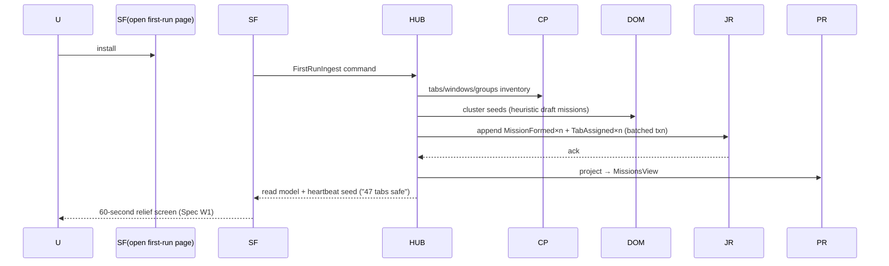

# LEDGE — SYSTEM BLUEPRINT
**Phase 4 · Engineering Architecture Document · v1.0**
**Governing documents (locked):** Product Vision → Product Specification → ADR-001…046.
**Rule of this document:** every structural claim here must trace to an ADR (citations inline). Nothing here changes product behavior (Spec) or product philosophy (Vision). This is *not* implementation: no code, no class shapes — only system structure, contracts, flows, and failure semantics, precise enough for independent senior engineers to build convergent implementations.

---

# SECTION 1 — SYSTEM OVERVIEW

## 1.1 The system in one paragraph
Ledge is a layered, hexagonal browser-extension monolith (ADR-001) whose core is a stateless **Service Worker authority** (ADR-005/007) that owns an append-only, segmented, checksummed **Journal** (ADR-003/004) stored in IndexedDB via a thin adapter (ADR-013/014). All mutations travel inward as **Commands**; all outward state is **Projections/Read Models** (ADR-005), streamed to dumb surfaces. Heavy work (AI jobs, import/export streaming, index building) runs in a single managed **Offscreen Document** (ADR-008). Browser capabilities are reached only through **Ports** (ADR-009); contexts communicate only through a **versioned message protocol** (ADR-010). Durability is guaranteed by **two-phase browser mutation** — intent committed before any visible change — with a boot reconciler for interrupted operations (ADR-011). Everything else (search, memory, trash, sync) is a projection of, or an artifact derived from, the Journal.

## 1.2 Major subsystems, responsibilities, ownership

| Subsystem | Responsibility | ADR basis | Executes in |
|---|---|---|---|
| **Core Authority (SW)** | Command dispatch, use-case execution, two-phase mutation, event ingest, projection dispatch, read-model fan-out, intent reconciliation | 005/007/011 | Service Worker |
| **Journal Engine** | Append, segment & seal, CRC, compaction-with-exclusion, integrity scan, checkpoints | 004/019/020 | SW (scans may chunk into offscreen) |
| **Projection Engine** | Event→read-model projectors, watermarks, rebuilds | 003/005/014 | SW (heavy rebuilds may delegate to offscreen) |
| **Storage Adapter** | All IndexedDB access (Dexie), schema/migrations, quota discipline | 013/014/034 | SW + offscreen (via port) |
| **Search Subsystem** | Inverted index projection, ranking, dupe detection, query execution | 015/016 | Index: offscreen; Query: SW; UI: surfaces |
| **Memory/AI Subsystem** | Durable AI jobs, provider ladder, confidence contract, artifact writing | 017/018/041 | Offscreen (execution), SW (orchestration) |
| **Portability Subsystem** | Import (preview/commit), Export (canonical model + renderers) | 044/045 | Offscreen |
| **Recovery Subsystem** | Boot reconciler, crash detection, journal repair, rescue backend, sessions cross-check | 007/011/019 | SW |
| **Surfaces** | Guardian (strip), Overlay (reflex search), Quiet Page (archive/trash/settings/rescue) | Spec §5.1 | Extension pages/overlay |
| **Sync (v2, boundary defined)** | Encrypted log replication, device registry, conflict merge | 042s/043s/021 | SW (deferred build) |
| **Diagnostics** | Redacted ring-buffer logs, health checks, diagnostics export | 027 | All contexts (buffer in IDB) |
| **Composition Roots** | Wire ports→adapters per context | 025 | One per context |

## 1.3 Boundaries (three kinds, kept distinct)

**Trust boundaries (ADR-040):**
- **Zone-0 (trusted):** SW, offscreen doc, extension pages — bundled code only.
- **Zone-1 (consented, narrow):** future per-site content scripts for opt-in indexing; communicate via a separate, reduced message schema; can *never* issue high-trust commands (ADR-010).
- **Zone-2 (untrusted input):** URLs, titles, imported files, page text. Validated/canonicalized at entry (ADR-016/040); rendered only through safe-text helpers.

**Data boundaries (ADR-020):** Class-1 Truth (journal, projections, sessions) → Class-2 Derived (memory artifacts, indexes) → Class-3 Volatile (caches, logs) → Class-4 Egress payloads (consented, redacted; empty in v1). Derived data is purge-chained to its source (`derivedFrom` links, ADR-014).

**Execution boundaries:** Contexts are hard edges (SW / offscreen / surfaces). The shared-kernel, domain, and application layers are *isomorphic* (run inside any context) but **authority lives only in SW** (ADR-005): surfaces never touch storage or browser APIs — they send commands/queries and render streams (ADR-010/037).

## 1.4 System lifecycle (macro)
`Install (onInstalled → first-run ingest, W1)` ⇄ `Steady state (event ingest → journal → project → fan-out)` with three recurring sub-cycles — *SW wake/recycle* (stateless rehydration), *maintenance windows* (compaction, purge sweeps, integrity scans, snapshot rotation), and *rescue events* (abnormal termination → boot reconcile → W7 recovery flow) — until `Uninstall (export offer; data file left intact per Spec §1.4)`.

---

# SECTION 2 — COMPLETE MODULE MAP

*Conventions: "Consumed/Produced" refers to domain/journal event types (catalog in §5.2). "Public interface" = contract usable by other modules; "Internal interface" = seams inside the module that exist for testing/substitution. Failure behavior is summarized here and tabulated exhaustively in Section 9.*

## 2.1 shared-kernel
| | |
|---|---|
| **Purpose** | Platform-free primitives every layer shares: identity (ULIDs), hybrid logical clock (HLC: seq/lamport/deviceId/wallClock), URL canonicalization, event schemas + upcasters, result/error types (ADR-004/016/026/033) |
| **Responsibilities** | Canonical URL form (matching only; originals preserved); event type registry w/ version suffixes; upcaster chain; confidence tri-state constant |
| **Dependencies** | None (zero imports outward) |
| **Public interface** | ID factory · Clock advance/merge · canon(url) · event registry lookup · upcast(event) |
| **Inputs/Outputs** | Raw records ⇄ canonical/typed records |
| **Failure behavior** | Pure functions — never throw for expected input classes; return Result-types |
| **Scalability/Evolution** | O(1); new event schemas append-only |

## 2.2 domain/ — bounded context: Lifecycle
| | |
|---|---|
| **Purpose** | Mission aggregate + TabRecord entity + lifecycle policies: park/restore/archive/conclude/delete laws, retention law, trash law, snapshot-before-close invariant (ADR-002/006, Spec §1.3) |
| **Responsibilities** | Decide *legality* of every transition; emit the decision payloads that become events; enforce "nothing parked is system-deleted"; "AI never mutates" is structural upstream (ADR-041) |
| **Dependencies** | shared-kernel only |
| **Public interface** | Transition deciders (park/restore/archive/conclude/delete/undo), Policy evaluators (retention, purge, conclude-flag semantics) |
| **Events consumed** | None directly (operates on command payloads + current projection state passed by application services) |
| **Events produced** | Decisions materialized by application layer: `MissionFormed, MissionRenamed, TabAssigned, TabMoved, ParkIntentAccepted, TabsParked, ParkAborted, ResumeAccepted, MissionResumed, MissionArchived, MissionConcluded, EntityTrashed, TrashRestored, TrashPurged, SnapshotTaken` |
| **Failure behavior** | Illegal transition → typed DomainError with recovery hint; no side effects ever |
| **Scalability/Evolution** | Pure; new spec features = new deciders/policies |

## 2.3 domain/ — bounded context: Memory
| | |
|---|---|
| **Purpose** | AI artifact semantics: naming/clustering/summary/brief/topic/link objects, confidence presentation law, die-with-source policy (Spec §6, ADR-017/018) |
| **Responsibilities** | Validate artifact shape (must carry confidence+provider+modelClass); map confidence→presentation tier (§6.11 constant); define purge-chain rules |
| **Dependencies** | shared-kernel |
| **Public interface** | Artifact validators · confidence→tier mapper · purge-chain spec |
| **Events produced** | `MemoryArtifactWritten, MemoryArtifactInvalidated, MemoryWiped` (Forget-everything flow) |
| **Failure behavior** | Invalid artifact → CapabilityError, not written, lane-noted |
| **Scalability/Evolution** | Artifacts rebuildable (derived); new capabilities add artifact kinds |

## 2.4 domain/ — bounded context: Portability
| | |
|---|---|
| **Purpose** | Canonical export model & import preview model semantics (ADR-044/045) — the *meaning* of "everything, open formats" |
| **Responsibilities** | Define canonical export tree (manifest→missions→tabs→artifacts), import preview aggregates (counts, dupes, rejects), checksum/compatibility metadata |
| **Dependencies** | shared-kernel |
| **Public interface** | Export-model builder spec · preview-model spec |
| **Events produced** | `ImportPreviewed, ImportCommitted (atomic batch), ExportCompleted` |
| **Failure behavior** | Model invariants (e.g., tab without mission) → quarantine to rejects, never abort whole batch |

## 2.5 application/
| | |
|---|---|
| **Purpose** | Use-case services (W1–W16 + ops), ports (ADR-009), message contracts (ADR-010), command/query streams, read-model hub, rules engine (v2), entitlement gates (ADR-046 constraint surface) |
| **Responsibilities (key services)** | IngestBrowserEvents · Park·Resume·Archive·Conclude·Delete·Undo · SearchQuery · Import Preview/Commit · Export · BootRecovery orchestration · Repair/Rebuild · DiagnosticsExport · (v2: SyncPush/Pull, RulesRun) |
| **Dependencies** | domain/*, shared-kernel; **forbidden:** any infrastructure import |
| **Public interface** | Command dispatcher (single entry) · Query handlers · Subscription hub (snapshot+watermark, then deltas) |
| **Events consumed** | All (it is the sole writer into journal) |
| **Events produced** | All domain events + `IntentCommitted/IntentCompleted/IntentAborted` (two-phase ledger) |
| **Failure behavior** | Fail-closed on mutations (ADR-026): durability doubt ⇒ refuse + disclose; queries fail-open with staleness flags |
| **Scalability/Evolution** | Use-case-per-file growth; entitlement check point central |

## 2.6 infrastructure/journal
| | |
|---|---|
| **Purpose** | Durable append, segmentation+sealing, CRC, compaction-with-exclusion, integrity scanning, checkpoints (ADR-004/019/020) |
| **Responsibilities** | Atomic appends (browser-mutation gating ack), segment rotation, purge-exclusion rewrite, snapshot-event emission, head/tail scan APIs |
| **Dependencies** | StorageEnginePort (via root injection), shared-kernel |
| **Public interface** | append(intent) → ack · readRange(from,to) · scanIntegrity() · compact(policy) · checkpoint() |
| **Events consumed** | All appends originate here by application call |
| **Failure behavior** | Write ack failure → ParkAborted path (Spec W4 law); CRC failure at segment N → truncate-to-(N−1) + `SnapshotReconciled` emission request (ADR-019 step 2) |
| **Scalability** | ~1M events/yr/user worst case; compression-neutral; compaction bounded by alarm-chunked jobs |
| **Future evolution** | Crypto-shredding alternate path pre-noted (ADR-020); sync tail-reader (ADR-042s) |

## 2.7 infrastructure/storage
| | |
|---|---|
| **Purpose** | Sole IndexedDB/Dexie access; schema v1 (events, missions, tabs, sessions, memory, meta) + migrations (ADR-013/014/034) |
| **Responsibilities** | Transactions, compound-index discipline (no scan-path queries), migration runner (checkpoint→migrate→assert→rollback-on-fail), quota monitoring, `storage.persist()` request, unknown-field round-trip preservation |
| **Dependencies** | Dexie (only runtime dep, ADR-036), shared-kernel |
| **Public interface** | StorageEnginePort: typed stores CRUD + txn scopes + migration hooks |
| **Failure behavior** | Quota pressure → surfaced to health checks + calm surface notice; migration failure → restore checkpoint, block writes, direct to rescue |
| **Scalability/Evolution** | SQLite-WASM attachable later behind this same port (ADR-013 reconsider path) |

## 2.8 infrastructure/projections
| | |
|---|---|
| **Purpose** | Turn the event stream into read models: missions view, tabs view, archive view, recently-closed view, trash view, search index feed, watermarks (ADR-003/005/015) |
| **Responsibilities** | Projector registry, ordered application (per-aggregate ordering by seq), watermark persistence, delta publication to subscription hub, full rebuild orchestration |
| **Dependencies** | journal (read), storage (write read models), shared-kernel |
| **Public interface** | project(events) · rebuild(projectorId|all) · watermark(scope) |
| **Events consumed** | Entire catalog (each projector declares subset) |
| **Events produced** | `ProjectionRebuilt, ProjectionCheckpointed` |
| **Failure behavior** | Projector error ⇒ mark projector dirty, alert health check, continue others; rebuild is always safe (read models disposable by rule) |
| **Scalability** | Incremental per-event O(1)-ish; rebuilds chunked with yields; projector checkpoints added at v1.1 per §14 |
| **Future evolution** | Sync-applier reuses same projector path for remote events (ADR-043s single-replayer law) |

## 2.9 infrastructure/search
| | |
|---|---|
| **Purpose** | Inverted index build/maintenance, tokenizer (unicode, CJK-bigram fallback), BM25-ish ranking + recency/open boosts, dupe matching (canonical hash + token Jaccard) (ADR-015/016) |
| **Responsibilities** | Index-as-projection (rebuildable), query-time fusion (scope widening per Spec W6), "already-kept" whisper data supply |
| **Dependencies** | shared-kernel canon, storage, (optionally memory.topics when present) |
| **Public interface** | SearchRankPort impl: query(q, scope) → ranked ids · dupesFor(urlCanon) |
| **Events consumed** | `TabObserved/Updated, TabsParked, MissionRenamed, MemoryArtifactWritten (topics), EntityTrashed` etc. |
| **Failure behavior** | Index missing/stale → keyword fallback directly on projections (slower but correct), health-flag set |
| **Scalability** | p95 <100ms @10k corpus budget (ADR-029); 50k tier = review per ADR reconsider clause |
| **Future evolution** | Semantic rank source composes behind same port (Ledge+); FTS5 projection path preserved |

## 2.10 infrastructure/ai (isolated package — ADR-041)
| | |
|---|---|
| **Purpose** | Durable job queue + lane scheduler + provider adapters + redaction gateway (ADR-017/018) |
| **Responsibilities** | Job persistence/coalescing/idempotency, priority lanes (interactive > maintenance > background), provider chain assembly by capability detection (Heuristic→OnDeviceML→BuiltIn→CloudDepth), confidence post-validation, budget caps (heat/battery/COGS), **hard import-isolation from all mutation-capable ports** |
| **Dependencies** | storage (jobs), shared-kernel, domain/memory validators; **forbidden:** TabsPort-close-class API, journal append, any surface |
| **Public interface** | Job intake (from application) — status reporting only; **results exit exclusively as Memory artifacts via application callback** |
| **Events consumed** | Via application-triggered job creation only (the AI package never subscribes to the journal directly — keeps blast radius legislatable) |
| **Events produced** | None to journal directly; artifacts flow through application (which writes `MemoryArtifact*`) |
| **Failure behavior** | Provider failure → circuit-break + next ladder rung; queue backlog → lane shedding (background first); malformed output → reject + count |

## 2.11 infrastructure/chrome (browser adapters)
| | |
|---|---|
| **Purpose** | Adapters for the ADR-009 port set: Tabs · Windows · TabGroups · NativeSessions · RuntimeEvents · Alarms · Offscreen · Permissions · StorageArea · Favicon · Commands · ContextMenus · Idle |
| **Responsibilities** | Callback→promise normalization, typed error mapping (ADR-025 error taxonomy), capability detection (offscreen reasons, AI builtins), event subscription plumbing into Ingest use case, browser-specific quirks containment |
| **Dependencies** | shared-kernel; implements application/ports |
| **Public interface** | The port contracts — nothing else may touch `chrome.*` |
| **Events produced** | Browser-originated observations for ingest: `TabObserved, TabUpdated, TabActivated(observed-activity), TabClosedExternal, WindowClosedExternal, GroupChanged, NativeSessionChanged` |
| **Failure behavior** | Chrome API rejection → CapabilityError w/ retry classification (transient vs structural); chaos-tested kill-points |
| **Scalability/Evolution** | Firefox adapters implement same contracts (contract-test gated); new APIs = new port methods, adapter-local |

## 2.12 infrastructure/recovery
| | |
|---|---|
| **Purpose** | Boot reconciler (dangling intents), crash detector, journal repair driver, sessions cross-check, rescue backend (ADR-007/011/019) |
| **Responsibilities** | storage.session marker lifecycle (crash signal), boot reconciliation policy (complete-safe vs leave-open-and-disclose — Spec law), integrity scan driver, recovery-candidate assembly from chrome.sessions |
| **Dependencies** | journal, chrome adapters, application (to raise W7 flow) |
| **Public interface** | runBootSequence() → BootReport (clean | recovered | reconciled(precise scope)) |
| **Failure behavior** | Uncertain completion state ⇒ conservative branch (leave open, mark stitched); never mass-act without proof |
| **Scalability/Evolution** | O(dangling intents) — normally zero; bounded scan |

## 2.13 infrastructure/importers
| | |
|---|---|
| **Purpose** | Parser set behind ImporterPort: onetab · sessionbuddy · netscape-bookmarks · ledge-export (ADR-044) |
| **Responsibilities** | Streaming parse (chunked, offscreen), preview model (counts/structure/dupe report), commit as atomic event batch (single undoable unit), reject quarantine files, provenance timestamps preserved as metadata |
| **Dependencies** | application services (commit), search (dupes), shared-kernel; **forbidden:** direct journal/storage access |
| **Failure behavior** | Corrupt rows → rejects list, continue; unrecognized → fail-safe w/ supported-formats reply (Spec W15); giant files → guard caps (ADR-040) |
| **Scalability** | 100k-line inputs streamed; preview <2s target for typical |
| **Future evolution** | Parser-per-request, gated by demand; parsers stay data (never third-party code — ADR-024) |

## 2.14 infrastructure/exporters
| | |
|---|---|
| **Purpose** | Canonical model builder + renderers: json (fidelity, checksums, manifest) · html (self-contained) · markdown (notes-style) (ADR-045) |
| **Responsibilities** | Streamed generation, chunk-verify-then-present (Spec W14 law), provenance stamping (format version = covenant, read-forever), memory-safe for archives ≥100k tabs |
| **Dependencies** | domain/portability model, storage reads, shared-kernel |
| **Failure behavior** | Chunk checksum mismatch → regenerate chunk; unrecoverable → calm fail with retry; **never** deliver silent partials |

## 2.15 infrastructure/sync (v2 boundary — defined, not built)
| | |
|---|---|
| **Purpose** | Encrypted tail-replication of journal segments + snapshot publish; device registry; remote-event application through the *same* replayer (ADR-042s/043s) |
| **Responsibilities (contract now)** | Relay adapter interface, crypto sealing (phrase-derived, XChaCha20-Poly1305), device registry ops, conflict application (total order; LWW+intent; delete-loses-to-edit → recovered-copy flow per Spec W10) |
| **Dependencies** | journal, storage, crypto port, relay port |
| **Failure behavior (contract)** | Relay down → queue-and-wait (journal already is the queue); unknown remote event types → preserve, skip projection (forward tolerance); key loss → honest unrecoverable-sync state (local unaffected) |
| **Notes** | Package exists as interfaces + tests harness shape; implementation deferred by ADR window |

## 2.16 surfaces/ (guardian · overlay · quiet-page)
| | |
|---|---|
| **Purpose** | The three vision surfaces (Spec §5.1); render read models & send commands/queries; hold zero authority (ADR-037) |
| **Responsibilities** | Guardian: park gestures, heartbeat, nudge slot · Overlay: reflex search UX · Quiet page: missions/archive/closed/trash/settings/rescue console; undo toasts; calm-copy catalog rendering; accessibility behaviors (§5.13) |
| **Dependencies** | application contracts (messages), surface-local state only |
| **Events consumed** | Read-model deltas + query results (subscription hub) |
| **Events produced** | None (they emit commands, never events) |
| **Failure behavior** | Stream loss → snapshot+watermark resync SOP; hub unreachable → read-only calm notice; **optimistic UI forbidden for truth-affecting verbs** (park/restore show acknowledged-pending state until `IntentCompleted`) |
| **Scalability/Evolution** | Virtualized lists (ADR-029); new surfaces subscribe, never write |

## 2.17 diagnostics/
| | |
|---|---|
| **Purpose** | Redacted ring-buffer logs (500, IDB), health checks, diagnostics exporter, repair console backend (ADR-027, §12) |
| **Responsibilities** | Cross-context log sink (structured, levelled, URL-hashed by default), include-addresses flip (24h auto-decay), health probe registry, export bundle assembly |
| **Failure behavior** | Buffer write pressure → drop-oldest silently; redactor failure → drop entry (never leak) |
| **Scalability/Evolution** | Fixed size; probes registry extensible per subsystem |

## 2.18 roots/ & ops/testing/
- **roots/ (ADR-025/037):** `bg-root` (SW: wires authority, adapters, journal, projections, ai-orchestration, recovery), `offscreen-root` (heavy-job executors), `page-root` (surface subscription wiring). Roots contain zero logic beyond composition.
- **ops/testing/** (ADR-032): fixtures (golden journals/exports/legacy imports) · port-contract suites · property suites (replay invariants) · migration fixtures · e2e golden flows (W1/W4/W5/W6/W13/W14/W15) · chaos (SW-kill mid-park, offscreen-kill, journal-corruption seeds, IDB latency) · perf harness (budget gates) · egress-guard (network allowlist = ∅) · dependency-cruiser rules (§4).

---

# SECTION 3 — PACKAGE STRUCTURE

```
ledge/
├─ manifest/                  # WXT-generated per browser family (ADR-036)
│   └─ docs: permission justifications (Principle 24 copy, ADR-022)
├─ src/
│  ├─ shared-kernel/          # zero deps: ids, hlc clock, canon, event schemas, upcasters, result/error
│  │  ├─ identity/            # ULIDs, deviceId provisioning
│  │  ├─ clock/               # hybrid logical clock mechanics
│  │  ├─ canon/               # URL canonicalization rules (data-driven denylist)
│  │  ├─ events/              # event registry + versioned schemas + upcaster chain
│  │  └─ result/              # Result/Error taxonomy (ADR-026)
│  ├─ domain/
│  │  ├─ lifecycle/           # Mission aggregate semantics, tab entity semantics, policies
│  │  │  ├─ transitions/      # pure deciders (park/restore/archive/conclude/delete/undo)
│  │  │  └─ policies/         # retention, purge, trash, conclude-flag, confidence-law
│  │  ├─ memory/              # artifact validators, presentation-tier mapping
│  │  └─ portability/         # canonical export model, import preview model
│  ├─ application/
│  │  ├─ usecases/            # W1–W16 services + ops (Repair, Rebuild, DiagnosticsExport)
│  │  ├─ ports/               # Tabs/Windows/Groups/NativeSessions/Runtime/Alarms/Offscreen/
│  │  │                       # Permissions/StorageArea/Favicon/Commands/ContextMenus/Idle/
│  │  │                       # SearchRank/StorageEngine/Importer/ExportRenderer/AI* /Crypto(v2)/Relay(v2)
│  │  ├─ contracts/           # message envelopes v1, payload schemas, boundary validators
│  │  ├─ hub/                 # command dispatcher, query handlers, subscription hub
│  │  └─ policy/              # entitlements gate (ADR-046 shape), flags evaluation (ADR-023)
│  ├─ infrastructure/
│  │  ├─ journal/             # appender, segments, crc, compaction(exclusion), scanner, checkpoints
│  │  ├─ storage/             # dexie adapter, schema v1, migrations, quota, persistence request
│  │  ├─ projections/         # projector registry, watermarks, rebuild orchestrator, delta publisher
│  │  ├─ search/              # tokenizer, index builder, ranker, dupe matcher
│  │  ├─ ai/                  # ISOLATED: jobqueue, lanes, providers/{heuristic,ondevice,builtin,clouddepth+redaction}
│  │  ├─ chrome/              # adapters/* (the only files allowed to import 'chrome')
│  │  ├─ recovery/            # boot reconciler, crash marker, sessions crosscheck, rescue backend
│  │  ├─ importers/           # parsers/* + preview/commit orchestration
│  │  ├─ exporters/           # model builder + renderers json/html/md + stream/verify
│  │  ├─ sync/                # v2 boundary: relay/crypto/registry interfaces + conflict replayer bridge
│  │  └─ diagnostics/         # ring buffer, redactor, probes, exporter
│  ├─ surfaces/
│  │  ├─ guardian/            # strip UI: park gestures, heartbeat, nudge
│  │  ├─ overlay/             # reflex search (⌘⇧K) — shares search-components w/ quiet page
│  │  ├─ quiet-page/          # library, recently closed, trash, settings, rescue console
│  │  └─ components/          # custom elements, safe-text helpers, calm-copy catalog, formatters
│  └─ roots/                  # bg-root, offscreen-root, page-root (composition only)
├─ ops/
│  ├─ fixtures/               # golden journals/targets, legacy import samples, corrupt-journal seeds
│  ├─ tests/                  # unit · port-contract · property · migration · e2e · chaos · perf
│  ├─ ci/                     # budget gates, egress guard, dep rules, bundle budget (<300KB gzip core)
│  └─ adr/                    # ADR-047+ follow-ups (append-only)
└─ docs/                      # export-format spec (public covenant), degradation matrix, threat model
```

**Why this shape:** every ADR constraint is *visible in the tree*: chrome-touching code is quarantined to one folder (audit); AI is a sibling quarantine (ADR-041); domain is import-clean by construction; ops/ guarantees exist as files, not intentions; the public covenant (export spec) lives in docs/, versioned with code (ADR-038/045).

---

# SECTION 4 — DEPENDENCY GRAPH (import law)

```
surfaces ──▶ application/contracts + hub       (messages only; no ports, no domain)
application ──▶ domain/* ──▶ shared-kernel
infrastructure/* ──▶ application/ports (implements) + shared-kernel
roots ──▶ everything (composition only)
ops/tests ──▶ everything (verification only)
```

**Allowed (explicit):**
1. `shared-kernel` ← everyone; imports nothing.
2. `domain` ← application, infrastructure(projections reads of policies allowed via application), tests.
3. `application/ports` ← infrastructure adapters implement; application consumes.
4. `surfaces` ← application `contracts` + `hub` client stubs only.
5. `ai` ← storage port (jobs), shared-kernel, domain/memory validators.

**Forbidden (lint-enforced, ADR-037/040/041):**
- domain → anything outside shared-kernel.
- application → infrastructure/concrete.
- surfaces → storage, journal, chrome, ai.
- **ai → any mutation-capable port, journal, surfaces, chrome adapters** (the ADR-041 law: AI structurally cannot park/close/delete).
- importers/exporters → journal/storage directly (they must pass through application services).
- chrome adapters → anywhere except through ports; nothing may import `chrome` outside `infrastructure/chrome` and `roots`.
- sync/v2 → surfaces (no UX shortcuts around entitlement gate).

**Cycle prevention:** strict layering (kernel < domain < application < infrastructure/surfaces < roots) + dep-cruiser CI rules per folder + build fails on any cycle, including test-only edges. Cross-infrastructure imports go **through application** (e.g., search never reads journal files directly; it consumes projection feed).

---

# SECTION 5 — DATA FLOW (how information actually moves)

## 5.1 Command path (mutation, the only write path)
`Surface action → contract validation (v1 envelope) → Command Dispatcher (SW) → Use-Case Service → Domain decider (pure) → Intent event appended (journal ack REQUIRED) → Browser mutation via port → Completion event appended → Projections updated → Delta fanned out to subscribers.`
Two-phase law (ADR-011): any step after intent-ack that fails leaves a **dangling intent** for the boot reconciler; completion is idempotent; surfaces display *acknowledged-pending → completed* honestly (no fake instant states).

## 5.2 Event catalog (v1, ~26 types — registry in shared-kernel)
`TabObserved · TabUpdated · TabActivatedObserved · TabClosedExternal · WindowClosedExternal · GroupChanged · MissionFormed · MissionRenamed · TabAssigned · TabMoved · ParkIntentAccepted · TabsParked · ParkAborted · ResumeAccepted · MissionResumed · RestoreAccepted(RestoreCompleted) · MissionArchived · MissionConcluded · EntityTrashed · TrashRestored · TrashPurged · SnapshotTaken · SnapshotReconciled · ImportPreviewed · ImportCommitted · ExportCompleted · MemoryArtifactWritten · MemoryArtifactInvalidated · MemoryWiped · SettingsChanged · ProjectionRebuilt · (v2 reserved: RuleCreated · RemoteEventsApplied · DeviceRegistered)`

## 5.3 Ingest path (browser → journal)
Chrome adapter events (tabs.onCreated/Updated/Moved/Attached/Removed, windows/Groups, sessions.onChanged throttled) → normalized to observation events → appended in **batches** (50ms window or 20 events, durability preserved per transaction) → activity metadata feeds (recently-active ranking, mission-formation triggers).

## 5.4 Projection path
Journal tailer (watermarked) → projector registry (each projector declares event subset: MissionsView, TabsView, ArchiveView, RecentlyClosedView, TrashView, SearchIndex, DupeIndex, MemoryIndex) → writes to stores in one txn per batch → delta publisher emits per-view changes with watermark → subscription hub → surfaces (`snapshot + watermark` on connect, then deltas).

## 5.5 Read/query path
Surfaces query via contracts → application queries **read models only** (never journal replay on read path, ADR-029) → search queries route through SearchRankPort (index hit) or fallback keyword scan (read models; flagged).

## 5.6 AI job path
Application enqueues job (durable) → lane scheduler (offscreen) claims via lease+heartbeat → provider ladder attempt (heuristic→ondevice→builtin→cloud if entitled+consented, via redaction gateway) → artifact post-validation (confidence mandatory) → application writes `MemoryArtifactWritten` → projections/memory views update → surface rendering tier applied (§6.11 law).

## 5.7 Search update path
Tab/mission/memory events → search-index projector (token emission; urlCanonHash maintenance; topic join when artifact exists) → index segments flushed in same batch txn; stale-window policy: if index lags > N events, query planner merges keyword scan of tail to keep results correct (correctness over freshness).

## 5.8 Storage write path
All writes in transactions scoped per use-case step; journal append and intent ledger in same txn where semantically required (two-phase hinge); read-model writes never in same txn as journal append (they're re-derivable; keeps truth-writes minimal & fast, per ADR-029 park budget).

## 5.9 Recovery path
`SW wake → storage.session marker check • absent ⇒ browser-level termination → integrity scan (tail) → boot reconcile intents (complete-safe / leave-open-and-disclose) → sessions cross-check candidates → BootReport → application raises W7 (recovery card opened — single quiet tab; mechanism note pending UX confirm) → user: Put-everything-back → Resume intents per mission.`

## 5.10 Sync path (v2 contract)
Local tailer encrypts new segments (device-key seals) → relay push (opaque) / pull remote device segments → decrypt → merge by (lamport, deviceId) total order → **same replayer/projectors** apply them (ADR-043s) → conflicts: silent merge default; recovered-copy flow when delete-vs-edit → surfaces unaffected except sync status chip.

---

# SECTION 6 — WORKFLOW BLUEPRINTS (sequence)

*(18 flows; participants abbreviated: U=user · SF=c=surface · HUB=application hub(SW) · UC=use case · DOM=domain · JR=journal · PR=projections · ST=storage · CP=chrome ports · REC=recovery · AIQ=ai queue(offscreen) · PRV=ai provider · IMP/EXP=portability · REL=relay(v2))*

## 6.1 Startup — install (W1 first-run)


## 6.2 Startup — SW wake (steady state)
```mermaid
Note over HUB: SW cold start (<200ms budget)
HUB->>ST: load meta (deviceId, schema v, checkpoints)
HUB->>REC: marker check + boot reconcile (§9.Recon)
HUB->>JR: verify tail (cheap CRC)
HUB->>PR: resume tailing from watermarks
HUB-->>SF(any subscriber): snapshot+watermark then deltas
```

## 6.3 Shutdown
```mermaid
Note over HUB: SW recycle: nothing to do (stateless doctrine)
Note over HUB: Browser close: no hook exists ⇒ marker (storage.session) simply dies
HUB-->>ST: (best-effort) flush pending logs via keepalive txn on visibility loss
```
*Doctrine: every write path is already durable; shutdown adds no special writes (ADR-007).*

## 6.4 Park Mission (core invariant)
```mermaid
U->>SF: park window
SF->>HUB: ParkMission(missionId)
HUB->>DOM: legality + snapshot plan
HUB->>ST: SnapshotTaken event + snapshot record (txn A)
HUB->>JR: append ParkIntentAccepted (txn A, same)  ✔ durable ack
HUB->>CP: tabs.remove(tabIds)                     ✔ only after ack
CP-->>HUB: removed
HUB->>JR: append TabsParked + ResumeBriefsEnqueued
HUB->>PR: update views; SF: heartbeat increments ("276 tabs safe")
Note over HUB: SW death pre-close ⇒ boot reconciler sees open tabs + intent ⇒ leave-open+disclose (Spec law)
```

## 6.5 Resume Mission
```mermaid
U->>SF: resume (card/archive/search)
SF->>HUB: ResumeMission
HUB->>DOM: legality (state=PARKED/ARCHIVED ok)
HUB->>JR: ResumeAccepted (durable)
HUB->>CP: windows.create + tabs.create(ordered, group styling)
CP-->>HUB: window/tab ids
HUB->>JR: MissionResumed(state=OPEN) → PR fan-out
HUB->>AIQ: job=resumptionBrief (if artifacts fresh enough, render now; else graceful absence)
```

## 6.6 Search
```mermaid
U->>SF(overlay): "purple pricing table march"
SF->>HUB: SearchQuery(q)
HUB->>SearchRankPort: query(scope=all)
alt index fresh
  SearchRank-->>HUB: ranked ids (+topics join)
else lagging
  SearchRank-->>HUB: ranked ∪ keyword-scan tail (correctness law)
end
HUB-->>SF: results (open-state, mission chips, confidence-neutral)
```

## 6.7 Crash Recovery (W7)
```mermaid
HUB(wake)→>REC: marker absent ⇒ abnormal
REC->>JR: integrity scan (CRC walk)
alt corrupt segment N
  REC->>JR: truncate to N−1; emit SnapshotReconciled(projections state)
end
REC->>HUB: reconcile intents → BootReport(precise scope)
REC->>CP: sessions.recentlyClosed (cross-check) → candidates
HUB->>SF(recovery card): "Everything is safe — as of 2:41 pm" + [Put everything back]
U->>HUB: confirm → per-mission Resume flow (6.5) w/ disclosure of any 410-marked urls
```

## 6.8 Import
```mermaid
U->>SF: choose file
SF->>HUB: ImportPreviewRequest
HUB->>IMP(offscreen): stream-parse → preview model + dupes + rejects
IMP-->>SF: preview (counts, structure)
U->>HUB: CommitImport
HUB->>DOM: domain mapping (groups→draft missions)
HUB->>JR: ImportCommitted (atomic batch; one undo unit)
HUB->>PR: index+views; AIQ: cluster/name jobs (maintenance lane)
```

## 6.9 Export
```mermaid
U->>SF: Export everything
HUB->>EXP(offscreen): canonical model from read models (+artifacts)
EXP->>EXP: stream chunks; per-chunk checksums; manifest
EXP-->>SF: verified file → user download (blob anchor; no downloads perm)
HUB->>JR: ExportCompleted (audit trail)
```

## 6.10 Delete (tab/mission)
```mermaid
U->>SF: delete
SF->>HUB: DeleteEntity
HUB->>DOM: legality; derive inverse payload (undo atom)
HUB->>JR: EntityTrashed(with inverse atom)
HUB->>PR: views→Trash; Memory purge-chain scheduled (die-with-source)
SF-->>U: Undo toast (10s) — deep undo via ⌘Z stack (persisted)
```

## 6.11 Undo
```mermaid
U->>SF: ⌘Z
SF->>HUB: Undo(actionId)
HUB->>ST: load inverse atom → DOM validates inverse transition
HUB->>JR: inverse event appended (new truth, never rewrite)
HUB->>CP: browser re-mutation if applicable (e.g., re-close a restored-then-undo)
Note over HUB: undo window: persisted stack, depth-bounded; Trash is the second net (§5.12 spec)
```

## 6.12 Archive / Conclude
```mermaid
U->>SF: Archive (or Conclude + outcome note)
SF->>HUB: ArchiveMission
HUB->>JR: MissionArchived (±Concluded)
HUB->>PR: exits daily views; joins library
HUB->>AIQ: final summary upgrade + topics + links refresh (maintenance lane)
```

## 6.13 Restore from Trash
```mermaid
U->>SF(Trash view): restore
HUB->>DOM: legality (parent mission alive? else re-create as new mission flagged)
HUB->>JR: TrashRestored → PR: back to views; purge-chain cancelled
```

## 6.14 AI Naming
```mermaid
PR(events)→>HUB: cluster formed (un-named mission exists)
HUB->>AIQ: job(naming, subject)
AIQ(offscreen)->>PRV: ladder: heuristic(if conf≥bar,stop) else ondevice → builtin
PRV-->>AIQ: name+confidence+modelClass
AIQ-->>HUB: artifact (validated vs §6.11 law)
HUB->>JR: MemoryArtifactWritten; PR→ MissionRenamed(ai) visible in views
```

## 6.15 AI Summarization (park-time)
```mermaid
HUB(after TabsParked)→>AIQ: job(summarize, mission, brief+oneliner)
AIQ->>PRV: inputs=titles/paths (+indexed content iff opt-in site)
PRV-->>AIQ: summary(+confidence)
AIQ-->>HUB: artifact→journal→views; Guardian card shows brief on resume (6.5)
alt failure → heuristic fallback (names+counts), note in lane; no banner (fail-open cosmetic)
```

## 6.16 Projection Rebuild
```mermaid
U/rescue->>HUB: Rebuild(projector|all)
HUB->>PR: mark dirty; reset watermark
PR->>JR: readRange(checkpoint→tip) chunked
JR-->>PR: events (batches, yields to keep SW responsive)
PR->>ST: write read models per batch; publish ProjectionRebuilt
SF: silent refresh from new snapshot
```

## 6.17 Journal Replay (recovery verification/rescue)
```mermaid
REC->>JR: full scan (CRC seal-by-seal)
alt all-good → replay into scratch stores → invariant assertions (no lost tabs; counts reconcile)
else corruption → truncate+SnapshotReconciled (6.7 path)
REC-->>SF(rescue console): precise report (what/where/when guaranteed)
```

## 6.18 Sync & Conflict Resolution (v2 contract)
```mermaid
HUB->>REL: push sealed segments (tail); pull remotes
REL-->>HUB: remote segments → decrypt (device keys)
HUB->>PR: apply via same replayer, order=(lamport,deviceId)
alt rename-vs-rename → LWW+intent; log for Memory-merge hints
alt delete-vs-edit → edit wins; delete→pending; recovered-copy card (Spec W10)
else silent merge (default, silence law)
```

---

# SECTION 7 — SYSTEM STATE

| Class | Content | Owner | Lifetime | Notes |
|---|---|---|---|---|
| **Persistent — Truth** | journal segments, checkpoints, intent ledger | infrastructure/journal | permanent+bounded by compaction law (ADR-020) | only append/compact; never random-write |
| **Persistent — Read models** | missions/tabs/archive/closed/trash views, search index, dupe index, watermarks | projections | rebuildable anytime | deleted on rebuild without ceremony |
| **Persistent — Derived** | memory artifacts (summaries/topics/names/links/vocab) | Memory context | lives/dies with source (purge chains) | provider/modelClass stamped |
| **Persistent — Policy** | settings (single versioned record), rules(v2), flags local overrides, entitlement token cache (v2, ≥30d grace) | application/policy | persisted; migrations included | settings NOT event-sourced (ADR-035 rationale) |
| **Runtime — Authority-working** | in-memory projector indexes, subscription registry, command queue heads | SW | per SW wake | disposable; rehydrate <200ms |
| **Cached** | favicons (30d TTL), last snapshot bundles per subscriber, search memoizations | various | TTL/watermark-invalidated | correctness never depends on cache (cold-cache E2E mode, ADR-030) |
| **Ephemeral** | message ports, pending cids, undo toast timers, AI lane leases/heartbeats | contexts | seconds–minutes | leases expire → job reclaimable |
| **Ephemeral forensics** | diagnostics ring buffer (500) | diagnostics | rolling | redacted default |

Ownership law: **single-writer = SW authority**; offscreen/UI hold mirrors and leases, never authority. Cross-context "shared" state flows only as versioned messages (ADR-010), never shared memory handles.

---

# SECTION 8 — EXECUTION MODEL

| Context | Runs there | Explicitly does NOT run there |
|---|---|---|
| **Service Worker** | Command dispatch; use-case execution; journal append; intent ledger; ingest normalization; projection dispatch+watermarks; search query; boot reconcile; maintenance triggers (alarms); sync loop (v2); subscription hub | AI inference; file parsing; DOM; long scans unchunked; anything blocking >50ms on command path |
| **Offscreen Document ("workroom")** | AI job executors (WASM/WASM-SIMD/WebGPU-optional); import streaming; export streaming+verify; index bulk builds; compaction CPU slabs; (future) embeddings worker / SQLite-WASM host | Chrome tab mutations; journal appends; entitlement decisions; message authority |
| **Surfaces (guardian/overlay/quiet-page)** | Rendering; local form state; keyboard maps; command/query sending; stream applying; accessibility behaviors | Storage access; browser APIs; direct AI; optimistic truth mutations |
| **Background maintenance (alarms)** | Tail integrity checks; purge sweeps (Trash 30d; Recently-Closed retention); segment rotation; compaction scheduler; snapshot rotation (30d per-mission) | Interactive work |
| **Idle/battery-aware windows** | AI maintenance lane; index catch-up; compaction steps | Interactive-lane AI |
| **User-interaction lane** | Overlay queries; rename/acknowledge corrections; park/resume commands | Any job >100ms without acknowledged-pending affordance |

Load-shedding doctrine: interactive lane never sheds (simplify instead); maintenance sheds silently; background sheds first and entirely (ADR-029 budgets + §10).

---

# SECTION 9 — FAILURE MODEL (by subsystem)

| Subsystem | Failure modes | Detection | Recovery / rollback | Retry policy | Fallback / degradation |
|---|---|---|---|---|---|
| **Journal** | write ack timeout; CRC mismatch; torn segment | append timeout (<250ms) → abort-aware; scans (tail each wake; full weekly) | ParkAborted path w/ tabs-left-open (Spec law); truncate-to-last-good + SnapshotReconciled | append: no blind retry (idempotency key check first) | if append path down → core read-only mode + calm banner; **never** fake durability |
| **Two-phase intents** | SW death between phases | ledger scan at boot | conservative reconcile (complete-safe or leave-open+mark) | re-execution idempotent by intentId | disclose scope on recovery card |
| **Storage (IDB)** | quota; corruption; migration throw | txn errors; health probe; migration assertions | checkpoint restore; block writes → rescue console w/ export offer | txn retry ×2 w/ backoff (transient class only) | read-only mode; capped-degradation matrix entry |
| **Projections** | projector throw; watermark skew | dirty flags; invariant probe (counts) | projector reset+rebuild (read models disposable) | rebuild resumable chunked | surface shows staleness chip; queries route keyword-fallback |
| **Chrome adapters** | API rejection; race (tab gone mid-op); permission revoked at runtime | typed errors; precondition re-reads | skip-and-stitch (mark affected records); reconcile next boot | transient: ×3 backoff; structural: none | capability absence → feature degrades (e.g., no groups-style restore) |
| **Offscreen** | spawn failure; killed mid-job; reason-enum drift | heartbeat lease expiry; spawn error | job reclaim (idempotent); doc respawn w/ capability-resolved reasons | job retry ×2 then lane-fallback (heuristic) | AI lane collapses to heuristic tier (Principle 29) |
| **AI providers** | latency, malformed output, low conf, budget exhaust | post-validation; circuit breakers; budget counters | breaker→next ladder rung; reject malformed | per-provider ×1 immediate + cooldown | heuristic names/summaries; absence-of-brief (Spec: prefer absence) |
| **Search** | stale/lagged index; tokenizer pathologies | watermark lag probe | tail-scan merge (correctness law); background rebuild | n/a | keyword-on-readmodels; semantic absent by tier |
| **Importers** | corrupt rows; unknown format; oversize | streaming parse guards | quarantine rejects; atomic abort if >threshold corrupt; calm report | user re-pick only | partial-good + rejects file (Spec W15) |
| **Exporters** | chunk checksum mismatch; IDB read error mid-stream | verify-then-present | regenerate chunk; calm fail + retry | chunk ×2 | never silent-partial (Spec law) |
| **Messaging/hub** | dead port; cid timeout; schema mismatch | envelope v check; timeouts | surface resync (snapshot+watermark SOP) | command re-send safe (idempotency) | read-only calm notice |
| **Recovery engine** | false crash positive (update vs crash); sessions API gaps | version-change marker disambiguation | present as "recovered session" nuance vs crash copy | — | manual "repair" affordance always reachable |
| **Sync (v2)** | relay down; key mismatch; unknown remote types | sync status probe | queue-and-wait; pause w/ plain-language notice | exponential backoff, jittered | local-first always fully functional |
| **Diagnostics** | buffer pressure; redactor throw | self-probe | drop-oldest; drop-entry (never leak) | none | no-op mode (product must work with logging dead) |

Global invariants: **fail-closed on truth, fail-open on cosmetics (ADR-026)**; every user-visible failure message ships from the calm-copy catalog with recovery path in the same sentence (Spec §5.11).

---

# SECTION 10 — PERFORMANCE MODEL

**Critical path (must stay <budgets, ADR-029):**
1. SW cold wake → hub ready: <200ms — tactics: rehydrate only meta + watermarks; lazy projector maps; zero AI on wake path.
2. Park(100 tabs) → durable ack: <500ms — tactics: single txn for snapshot+intent; close executed after; projection updates async (not in-ack path).
3. Reflex search: p95 <100ms @10k — tactics: index-first; tail-scan capped; resulting hydration from read models only; memoized queries per overlay session.
4. Quiet-page first render: <300ms @1k missions — tactics: chunked dynamic-import of heavy surfaces components? **No — bundle discipline instead (ADR-036)**: quiet page ships as separate entry chunk loaded on demand (dynamic import of *bundled* surface code is permitted; remote code is not); virtualized lists; favicon lazy+TTL cache.

**Async path:** projections, AI lanes, compaction, purge sweeps, index builds — all alarm/idle scheduled with yields; SW time-boxed slices (<5s per slice) to stay within platform patience.

**Batching:** ingest 20-events/50ms; delta fan-out coalesced at frame-rate for surfaces; index flushes per batch txn; AI coalescing by subject-hash.

**Caching:** watermark-invalidated in-memory mirrors; cold-cache correctness guarantee (ADR-030); favicon TTL 30d; search memo per overlay session only.

**AI scheduling:** lease+heartbeat claims; lanes (interactive > maintenance > background); background only in idle+battery-ok windows; per-day cloud budget caps (Ledge+ governance); breaker on provider latency > threshold.

**Memory budgets:** SW ≤30MB steady · offscreen ≤40MB idle (models unloaded after idle window) · surfaces ≤60MB active · total standing footprint <75MB (ADR-029) — measured in perf harness with deterministic seeds.

**CPU budgets:** ingest projections amortized <5ms/event; compaction chunks <30s CPU bursts; tokenizer SIMD-optional.

---

# SECTION 11 — SECURITY MODEL

**Trust boundaries (ADR-040):** Zone-0 privileged core; Zone-1 consented content scripts (future; separate reduced schema; no high-trust commands — enforced by contract allowlists per sender-context); Zone-2 untrusted input.

**Permission boundary mapping:** each ADR-022 permission ↔ exactly one port; adapters declare required permission statically; runtime optional permissions (per-site indexing) requested only behind the §6.8 consent sheet; **no `history`, no `notifications`, no `downloads`, no host-access at install** (trust handshake law).

**Input validation catalog:** URLs → scheme allowlist http/https (at *every* open/restore call); titles/strings → safe-text renderers only (no innerHTML ever); imported payloads → size caps, chunked timeout guards, structural schema validation before preview; message payloads → boundary validators per contract version (reject-unknown on Zone-1 schema).

**Browser security:** CSP `script-src 'self'; object-src 'none'`; documented `wasm-unsafe-eval` exception scoped to extension pages for on-device AI (comment-tied, ADR-040); no dynamic remote imports; favicons via `_favicon` API only; navigation via TabsPort with allowlist re-check (no `javascript:`/`chrome:` schemes ever re-issued).

**Data protection:** Class taxonomy + purge chains (ADR-020); compaction-with-exclusion; redaction gateway for any future cloud egress (ADR-018) — strips params per denylist, drops titles for missions flagged private; diagnostics redaction by default with 24h auto-decay include-flip (ADR-027); sync (v2): zero-knowledge sealing, relay sees only ciphertext + opaque ids (ADR-021/042s).

**Attack surface inventory + stance:** imported files (guards above) · message endpoints (sender-context allowlists) · malformed web content via titles (safe-text) · future cloud egress (redaction+budgets+breakers) · dependency supply chain (≤5 runtime deps, pinned, audited, Dexie-only v1) · store-listing social engineering (outside code scope; ops playbook).

---

# SECTION 12 — OBSERVABILITY

**Diagnostics:** structured ring buffer (500, IDB), levels, redacted-by-default (URLs→hashed), include-addresses flip w/ 24h auto-decay; user-initiated export bundle (calm copy: leaves device only on explicit send choice) (ADR-027). No remote telemetry anywhere (ADR-028); CI egress-guard enforces.

**Health probes (registry; surfaced in rescue console + quiet-page footer when unhealthy):**
journal tail CRC freshness · projection watermark lag per projector (events-behind) · dangling intents count · storage quota % + persistence granted? · last compaction age · trash sweep health · AI lane depths + breaker states · index freshness (search) · offscreen spawn success-rate · boot-report status (last).

**Integrity verification:** on-demand and scheduled: full journal scan (CRC walk) + scratch-replay invariants (no-lost-tabs, referential counts) + export-spot-verify (round-trip sample).

**Repair tooling (rescue console backend):** rebuild projector(s) · repair-from-journal (reprojection) · truncate+reconcile trigger (guarded, explain-first) · integrity report export · "forget everything" (Memory wipe; disclosed, tabs untouched).

**Debugging playbooks (docs/ops):** kill-point chaos recipes; corrupted-journal seed files; slow-IDB simulation; time-travel fixtures (frozen HLC) — each playbook maps failure → probe to consult → tool to run.

---

# SECTION 13 — EXTENSIBILITY (adding without breaking the constitution)

| Future addition | Integration path (ADR-guarded) |
|---|---|
| New domain event type | Register in shared-kernel events (new, never mutate old); upcasters for any payload drift; projectors subscribe; ADR note if semantic novelty |
| New AI capability (spec §6 list growth) | New job kind + provider binding behind existing ports; confidence+isolation laws auto-apply (no new privileges possible) |
| New importer | parser package behind ImporterPort; two-phase/atomic-batch rules mandatory; fixtures added |
| New export renderer | renderer beside existing three; canonical model unchanged (covenant untouched) |
| New surface | subscription-hub client; zero new write paths; dep-law lint auto-covers |
| Firefox adapter family | implement port contracts; pass contract suite (ADR-032); release gate = suite green |
| Semantic rank source (Ledge+) | plugs as additional rank behind SearchRankPort; must fail-optional |
| Sync build (v2) | fill parked interfaces; reuser law (same replayer/projectors) is compile-visible |
| New permission demand | requires new ADR + Principle-24 sentence + UX comms (ADR-022 process) |
| Any cloud endpoint | ADR + redaction-gateway integration + egress-guard update (single allowlist table) |

Forbidden extensibility remains forbidden: plugins/third-party code (ADR-024), remote config, programmatic external API (ADR-038), AI mutation capabilities (ADR-041).

---

# SECTION 14 — SYSTEM REVIEW (adversarial audit of this blueprint)

**Mandate: find weaknesses without re-opening locked ADRs; propose ADR-compatible improvements.**

1. **SW single-writer is a throughput ceiling.** *Finding:* human-scale input makes this fine; risk is automation storms (import-commit fan-out + ingest bursts queueing interactive commands). *Improvement (compatible):* priority classes inside the dispatcher (interactive command class jumps the queue; AMP — the spec's silent-correctness law unaffected). *Add to ADR-011 implementation notes.*
2. **Delta stream vs SW recycling.** *Finding:* in-memory delta buffers die with SW; surfaces reconnecting mid-gap need catch-up. Locked decision (snapshot+watermark resync SOP) is correct but re-sends snapshots. *Improvement:* persist a tiny delta ring (last 500 deltas, IDB) — bounded, rebuild-safe, removes most full re-snapshots; projector-checkpoint records (ProjectionCheckpointed) shrink rebuild time on mega-archives. Defer to v1.1; no ADR change (it is an implementation of ADR-005 fan-out).
3. **Compaction-with-exclusion is the heaviest module.** *Risk:* correctness bugs here violate the charter (purge law). *Improvement:* (a) segment rotation epochs sized so exclusion rewrites touch ≤ old sealed segments; (b) property tests asserting "purge ⇒ bytes absent"; (c) keep crypto-shredding spike warm (ADR-020) — pull forward if compaction p-latency exceeds budget at 200k+ archives.
4. **Recovery-card opening mechanism.** *Finding:* without `notifications`/content scripts, W7's banner must open a quiet tab; opening tabs automatically can feel intrusive (silence law tension). *Resolution proposal (product-compatible):* open the recovery card *only* when BootReport contains meaningful loss-risk (dangling intents / corruption); for clean-but-abnormal exits show guardian heartbeat state "recovered" instead — card on demand. *Flagged to UX spec owner; ADR untouched.*
5. **Search stale-tail scan could wobble p95 on huge lags.** *Improvement:* cap tail-scan (≤2k events) and mark results "index catching up"; index-refresh urgency lane. Within ADR-015/029.
6. **AI coalescing vs subject-hash collisions across rapid renames.** *Minor:* include seq watermark in job key; trivial note.
7. **Offscreen single-doc multiplexing creates head-of-line block (export behind AI).** *Improvement:* job lane fair-scheduling already specified; add "big-job isolation" rule: exports/imports occupy exclusive lane — implemented as lane config, no structural change.
8. **Duplicate: dupe-matcher vs canonicalization overlap.** Consolidated: matcher consumes canon kernel only; no second normalization logic anywhere (documentation fix, reduces drift risk).
9. **Crash-detector ambiguity on browser updates.** *Improvement:* version-change marker disambiguates "recovered after update" vs "crash" — copy differs (calm standard); noted in recovery module (§6.3/§9 row Recovery engine).
10. **Tight coupling watch:** projections↔search (topic join) and recovery↔application (W7 raise) are the two most-coupled seams; both are contract-defined already — keep contract tests dense there; no change.
11. **Maintainability risks:** (a) event-schema sprawl → enforce catalog review per release (cap aspirational ~40 types v3); (b) calm-copy drift → copy catalog lint (no exclamation marks, CI check) — playful but binding per Principle 22.
12. **Scaling horizon:** the design's first true ceiling is storage latency on 200k-tab archives (projection rebuild minutes-scale). Mitigations already staged (checkpoints, SQLite-WASM fallback per ADR-013 reconsider clause). No earlier optimization justified (Principle 20: decide late where cheap).

**Verdict:** module map is tight, boundaries match ADR law, no charter violations detected. Improvements #1, #2 (delta ring + projector checkpoints), #3(b), #7 land as v1.1 engineering notes; the rest are documentation/CI hardening.

---

*Blueprint ends. Next sanctioned document: **Milestone & Interface Contracts** — the Tier-0/1 build order (per ADR dependency graph), port interface specifications, and message-contract v1 schemas — still pre-code, but immediately actionable.*
